# 微前端解决巨石应用

# 技术讲解

## 什么问题

我抛几个场景，大家思考一下：

1. 老板扔给你一个 5 年陈年的项目，需要你在这个项目上持续迭代加功能。如何解决老代码不敢动，新技术又想用的困境？既要跟随业务的产品迭代，又要保证代码库健康，并且旧的类库最好能平稳升级？
2. 你们起了一个新项目，但是架构上的一个要求："如何确保这套技术方案在 3~5 年内还有生命力，不会在 3、5 年后变成又一个遗产项目？"
3. 一个项目多个团队开发，之前是几个独立的项目，现在由于业务的需要，老板需要统一入口管理，那么如何进行整合？整合的时候极大可能产生冲突，如何解决并行开发的冲突的问题？

当然了，你可以说我只需要把新功能用 react/vue 开发，反正他们都只是 ui library，给我一个dom 节点我想怎么渲染怎么渲染。但是这只是浮在表层的视图实现，沉在底下的工程设施呢？

我要怎么把这个用 react 写的组件打出一个包，并且集成到原来陈年项目用 es5 写的代码里面？而且就算是react，15,16,18,19如何保证兼容？更不用说是之前不同团队开发的不同项目，这可能从框架，从工程，从项目规范上都有很大的区别。

或者我怎么让 webpack 跟 之前的 grunt 能和谐共存一起友好的产出一个符合预期的 bundle，现在还好都默认 webpack，那 webpack 版本升级呢，每次都跟进吗？别忘了还有 babel、sass、typescript 诸如此类呢

或者这项目已经持续多年了，开发阶段每一次启动可能都是一场持久战，更别说调试了。甚至你的机器差一点，都有可能启动不成功

## 解决思路

也就是说，我们这个项目，无论如何，新的也好，陈年老项目也罢，肯定是一个需要长期维护运行的，业务复杂的，并且可能是多团队开发的项目。

那么对于这种项目，要么可能之前就是一个苟延残喘，步履蹒跚的巨型应用，我们能想到的能立竿见影的解决方案就是根据业务分拆，然后再进行整合。不然这个项目就只能在屎上雕花

要么可能是公司内部存在的多个独立业务的需要进行整合，那这个还简单一些，少了上面的分拆步骤。

当然如果是打算开始新启一个长期维护的大型项目，那么很多工作我们可以一开始就做好规范，当然最基础的还是在一开始就确定业务的拆分

根据这里的需求，那基本要求我们这个项目需要做到**各个业务模块之间隔离，最好技术栈无关、具备独立开发、独立部署和可以增量扩展迁移**的特点。

基于这种需求，业内也就出现了一个新的名词：**微前端**

### 什么是微前端

**微前端（Micro-Frontends）**是一种类似于微服务的架构，它将微服务的理念应用于浏览器端，即将 Web 应用由单一的单体应用转变为多个小型前端应用聚合为一的应用。各个前端应用还可以独立运行、独立开发、独立部署。

**微前端不是单纯的前端框架或者工具，而是一套架构体系**，而这套架构体系也有着**很多的实现方案**。

### 对比

#### 普通单体应用

##### 页面表现

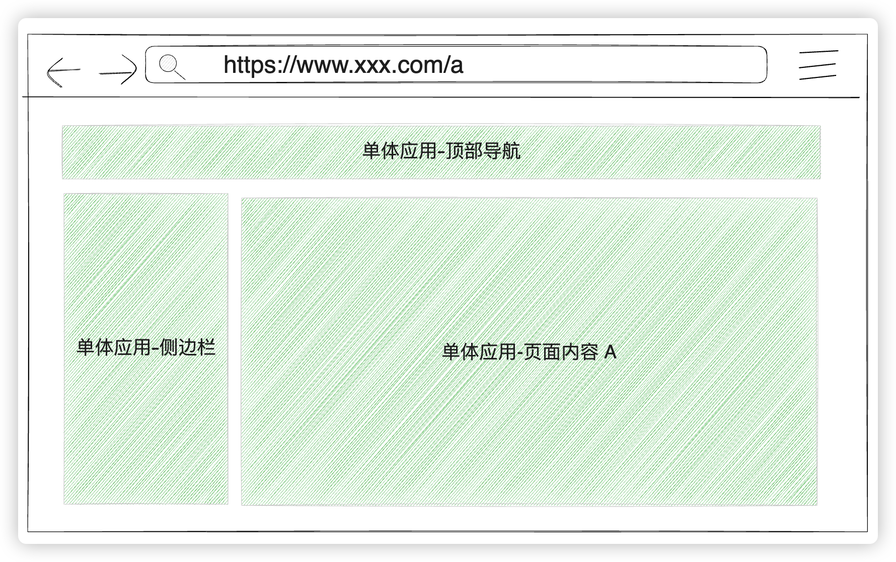

**URL与页面变化：**

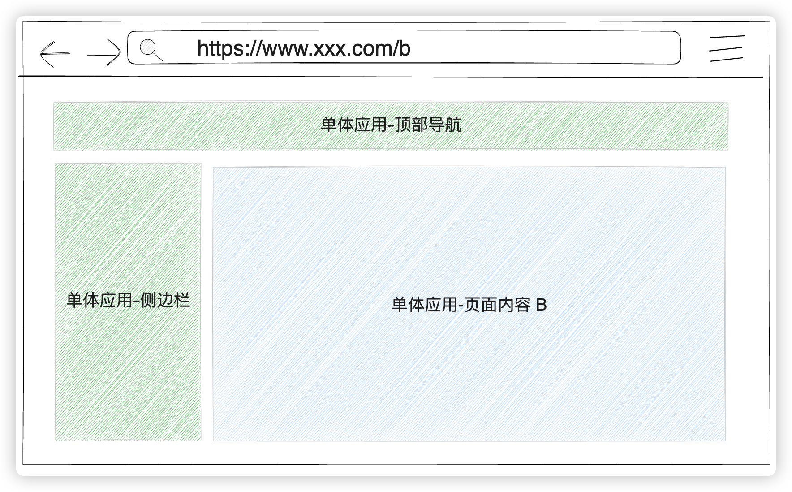

##### 访问流程


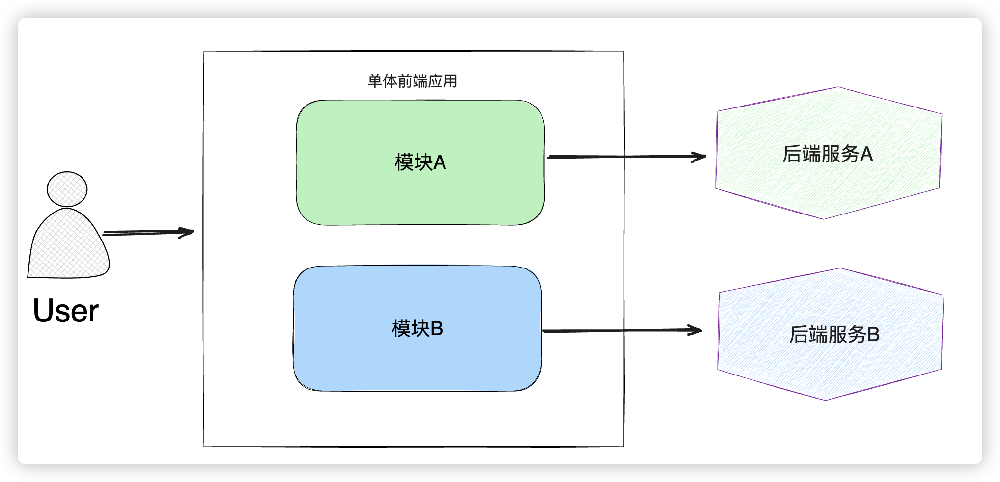

#### 多页应用/多个单体应用

##### 页面表现

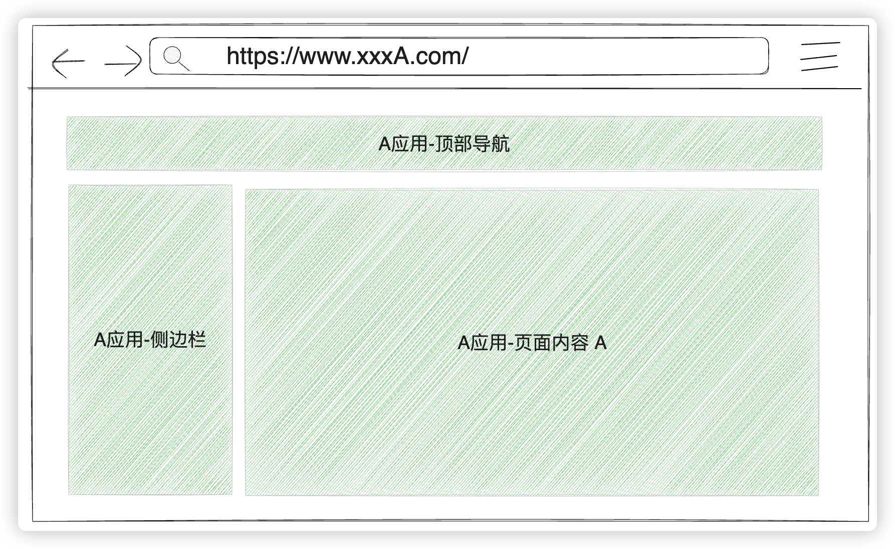

**URL与页面变化：**

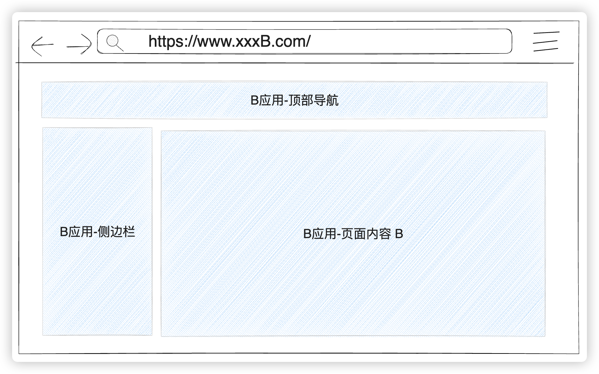

##### 访问流程

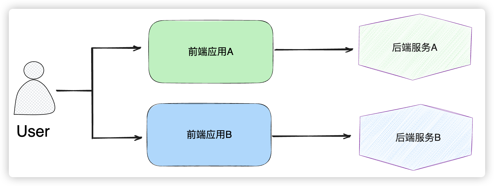

#### 微前端应用

##### 页面表现

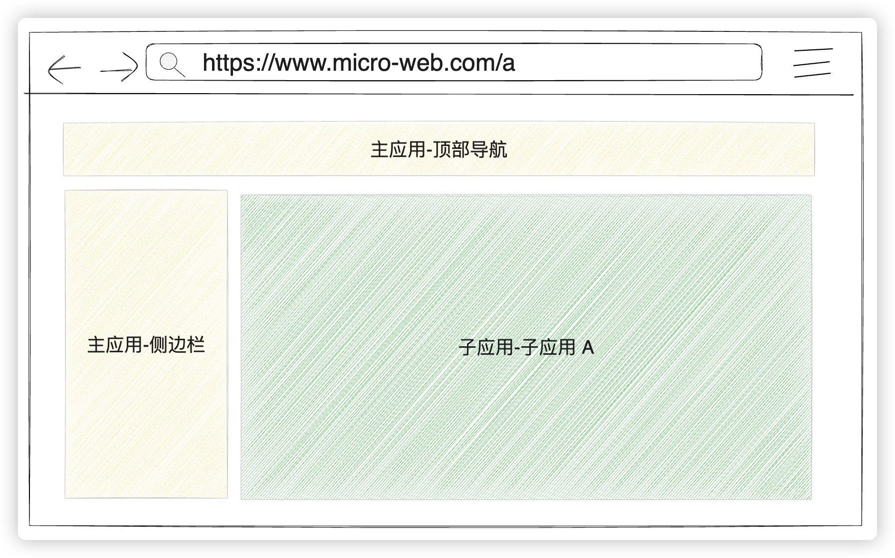

**URL与页面变化：**

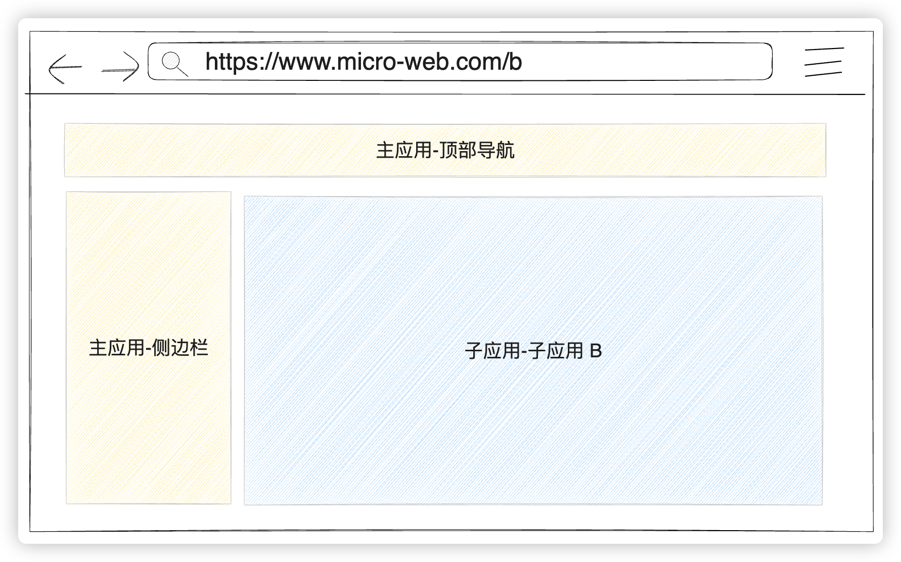

##### 访问流程

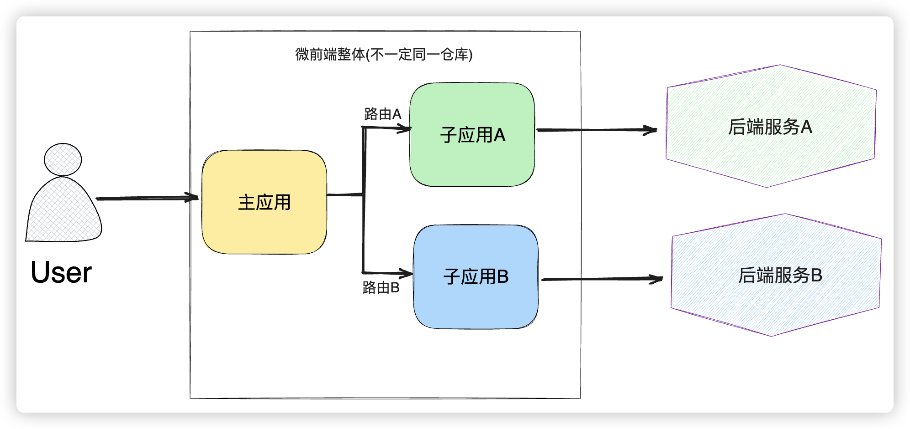

### 微前端的实现方案


**这需求不就是 iframe 么？**

过去，当我们需要在一个项目中嵌入另一个项目时，首先想到的当然是 `iframe`。对于这种大型项目，有天然的优势，比如`iframe`具有天然的隔离性，其实在我们想到要集成各个项目的时候，首先就会想到各个项目之间js，css会不会产生冲突，但是如果使用`iframe`，就根本不需要考虑这么多问题。

但他的最大问题也在于他的隔离性无法被突破，导致应用间上下文无法被共享，随之带来的开发体验、产品体验的问题：

- URL 不同步。浏览器刷新 iframe url 状态丢失、后退前进按钮无法使用；
- UI 不同步，DOM 结构不共享，iframe内部弹窗浮层不能展示在页面中心、遮罩只能遮住iframe；
- 全局上下文完全隔离，内存变量不共享。iframe 内外系统的通信、数据同步等需求，主应用的 cookie 要透传到根域名都不同的子应用中实现免登效果。iframe内部错误也无法监控
- 页面加载速度慢；每次子应用进入都是一次浏览器上下文重建、资源重新加载的过程

那既然iframe的实现有这么多缺陷，那有没有其他替代方案呢？其实我们还可以有一种简单的实现方式：

**基于`Nginx` 路由分发的实现**

通过路由将不同的业务**分发到不同的、独立前端应用**上。其通常可以通过 **HTTP 服务器的反向代理**来实现。

例如`www.abc.com/app1`对应app1，`www.abc.com/app2`对应app2，这种方案本身并不属于前端层面的改造，更多的是运维的配置，当然这么做优点十分明显了，简单，快速，易配置。缺点其实也和iframe差不多，iframe有的缺点他都有，比如在切换应用时触发发页面刷新，项目之间通信不易

与之相近的，也可以在工程化上想办法，比如：

**基于`Npm` 的集成**

将子应用封装成npm包，通过组件的方式引入，在性能和兼容性上是最优的方案，但却有一个致命的问题就是版本更新，每次版本发布需要通知接入方同步更新，管理非常困难。而且也不可能成为一种长期维护的架构选择，随着时间的推移，系统越来越臃肿，不同npm之间的管理会越来越困难，特别是如果还有关键人员的变动的话。

上面三种方式，其实都可以算是微前端的实现方式，但是对于现代的前端系统来说，略显简陋。

**于是……**

**2018年: 第一个微前端工具 single-spa 在 github 上开源**

single-spa是一个用于**前端微服务化**的JavaScript前端解决方案。single-spa的核心就是定义了一套**协议**。协议包含**主应用的配置信息**和**子应用的生命周期**，通过这套协议，**主应用可以方便的知道在什么情况下激活哪个子应用**。

简单来说：**子应用之间完全独立，互不依赖。统一由基座工程(主应用)进行管理，按照DOM节点的注册、挂载、卸载来完成**。

当前流行的大量框架都是single-spa的上层封装，但是如果作为生产选型，single-spa提供的是较为基础的api，应用在实际项目中需要进行大量封装且入侵性强，使用起来不太方便。

由此引出了很多微前端框架，在国内比较出名，社区比较活跃的微前端框架有：

- 阿里的[qiankun](https://qiankun.umijs.org/)
- 京东的[Micro-app](https://cangdu.org/micro-app/)
- 腾讯的[无界](https://wujie-micro.github.io/doc/)

具体实现细节虽然各自有差异，但是总体架构基本都是**主应用(基座应用)---子应用**这种方式

当然，后续**webpack 提出 Module Federation，模块联邦技术**，这个技术允许在多个 webpack 编译产物之间共享模块、依赖、页面甚至应用。每个构建都充当一个容器，也可将其他构建作为容器。通过这种方式，每个构建都能够通过从对应容器中加载模块来访问其他容器暴露出来的模块。

简单来说就是:**可以使用别人共享的模块，自己也可以共享模块给别人，这样可以真正的让项目达到微模块的级别**

国内也有相应的框架实现，比如：

- YY的[EMP](https://emp2.netlify.app/)

不过模块联邦缺陷也非常明显，并不是现在主流的微前端框架，一是对 `webpack5` 强依赖，老旧项目不友好，二是也没有有效的 css 沙箱和 js 沙箱，需要靠用户自觉

## 解决细节

### 常见微前端框架基础组成

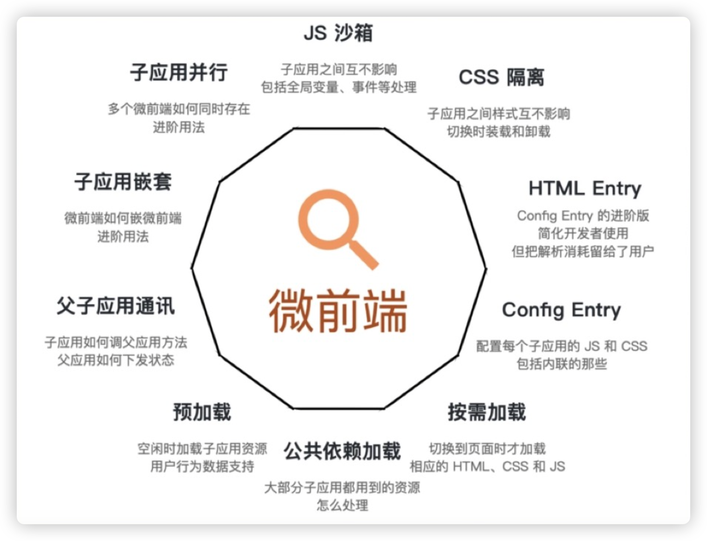

#### 微前端框架面临的两大共性问题

实际上所有的微前端框架都面临这两大共性问题。当你解决了这两大问题之后，你的微前端框架的运行时，就已经基本可用了。

- 问题一是**应用的加载与切换**。包括路由的处理、应用加载的处理和应用入口的选择。
- 问题二是**应用的隔离与通信**。这是应用已经加载之后面临的问题，它们包括 JS 的隔离（也就是副作用的隔离）、样式的隔离、也包括父子应用和子子应用之间的通信问题。

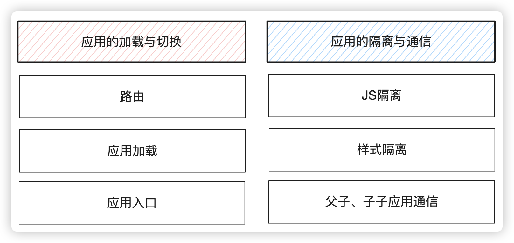

当然首先这两个问题是什么意思？

> 简单来说，之前使用iframe，我们不用考虑太多，直接主应用中，通过iframe内嵌子应用就行了。那现在使用的这些微前端框架，在不使用iframe的情况下，需要想一种办法，通过主应用加载到子应用，并且把子应用的内容加载到主应用的页面进行显示。而且在实现这些的同时，还不能造成主应用和子应用之间的冲突，也就是所谓的js隔离和样式隔离。而且最好还能够实现应用之间的通信，这样就可以弥补使用iframe所带来的缺点。

那么首先我们提到的这几个国内常见的微前端框架，

- 阿里的[qiankun](https://qiankun.umijs.org/)
- 京东的[Micro-app](https://cangdu.org/micro-app/)
- 腾讯的[无界](https://wujie-micro.github.io/doc/)

是怎么实现将子应用加载到主应用，并且把子应用的内容加载到主页面进行的显示的呢？

那无非就是：

1、需要一个地址加载到子应用，也就是所谓的路由

2、将URL地址读取的子应用内容，渲染加载出来

#### 加载子应用

对于加载子应用，现在主流的主要是两种方式：

##### 1、基于 single-spa实现

通过注册微应用方式（registerMicroApps），把路由path跟子应用关联起来，跳转对应路由时，微应用就会被插入到指定的container（dom）中。同时依次调用微应用暴露出的生命周期钩子。微应用里可以再定义子路由。

```js
import { registerMicroApps, start } from 'qiankun';

registerMicroApps([
  {
    name: "app-vue2-demo", //子应用名称，唯一
    entry: "//localhost:4001", //子应用地址
    container: "#subapp-container", // 子应用挂载的div
    activeRule: "/app-vue2-demo", //子应用激活规则
  },
]);
// 启动 qiankun
start();
```


##### 2、基于Web Components

先在主应用里自己定义路由，然后在路由组件里使用 `Web Components`，子应用里可以再定义子路由

**路由配置**

```js
// 路由配置
{
  //路由路径最好是非严格匹配
  path: "/app-vue2-demo*",
  name: "Vue2DemoPage",
  component: () => import("@/views/Vue2DemoPage.vue")
}
```

**对应页面**

```typescript
<template>
  <div>
    <!-- 
      name(必传)：应用名称
      url(必传)：应用地址
      baseroute(可选)：基座应用分配给子应用的基础路由
     -->
     <micro-app 
      name='app-vue2-demo' 
      url='http://localhost:4001/' 
      baseroute='/app-vue2-demo'
     >
    </micro-app>
  </div>
</template>
```

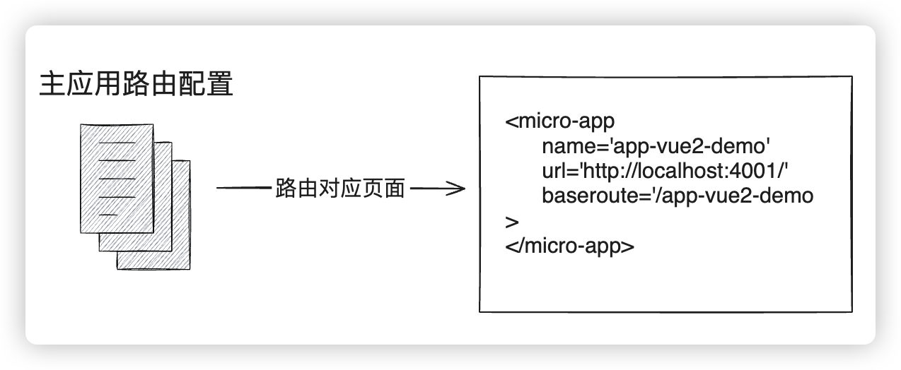

##### Web Components

Web Component是HTML5推出的一个新特征，顾名思义就是web组件，Web Component是一个概括性的术语。它描述的其实是三种不同的全新的API：**自定义元素，Shadow DOM和HTML模板**

* 自定义元素。 在 HTML 基础标签外扩展自定义标签元素
* Shadow DOM。 主要用于将 Shadow DOM 的内容与外层 document DOM 隔离
* HTML 模板。 使用 `<template>` 来定义组件模板，使用 `<slot>` 作为插槽使用

```js
class CustomButton extends HTMLElement {
  constructor() {
    super();
    let value = this.getAttribute("value");
    // 可以直接放入到innerHTML中
    // this.innerHTML = `<button>custom-button ${value}</button>`

    // 也可以通过appendChild的方式添加元素对象
    let btn = document.createElement("button");
    btn.innerHTML = `custom-button ${value}`;
    btn.addEventListener('click', () => { 
      this.setAttribute("name", "test");
      this.setAttribute("value", 89);
    })
    this.appendChild(btn);
  }
  // 当 custom element首次被插入文档DOM时，被调用
  connectedCallback() {
    console.log("connectedCallback");
  }
  // 当 custom element从文档DOM中删除时，被调用
  disconnectedCallback() {
    console.log("disconnectedCallback");
  }
  // 当 custom element增加、删除、修改自身属性时，被调用
  attributeChangedCallback(name, oldValue, newValue) {
    console.log("attribute", name, oldValue, newValue);
  }
  // 声明需要监听的属性名，只有这些属性变化时才会触发attributeChangedCallback
  static get observedAttributes() {
    return ["name", "url", "value"];
  }
}
//参数一：自定义元素名，格式有要求：短线连接的字符串
//参数二：自定义元素构造器
//参数三：可选，含有 extends 属性的对象。指定所创建的元素继承自哪个内置元素，可以继承任何内置元素
window.customElements.define("custom-button", CustomButton);
```

#### 渲染

渲染的实现无论是webcomponent的方式，还是基于single-spa的方式其实就大同小异了。感觉上很复杂，其实原理上很简单，实现起来稍微麻烦一点而已。

最开始single-spa给出的加载方案是**JS Entry**，简单来说，就是将子应用将资源打成一个entry script，但是这个方案限制很多，比如子应用的所有资源打包到一个 js bundle 里，包括 css、图片等资源。这样除了打出来的包可能体积庞大之外的问题之外，资源的并行加载等特性也无法利用上。

**qiankun**在此基础上封装了一个应用加载方案，即 **HTML Entry**  ，**HTML Entry** 则更加灵活，直接将子应用打出来 HTML作为入口，主框架可以通过 fetch html 的方式获取子应用的静态资源，同时将 HTML document 作为子节点塞到主框架的容器中。这样不仅可以极大的减少主应用的接入成本，子应用的开发方式及打包方式基本上也不需要调整

说的很高大上，你可以这么简单来理解：实际上就是通过上一步路由加载，找到对应的子应用HTML，然后ajax fetch读取...然后解析，然后将需要的内容再放到主应用上渲染

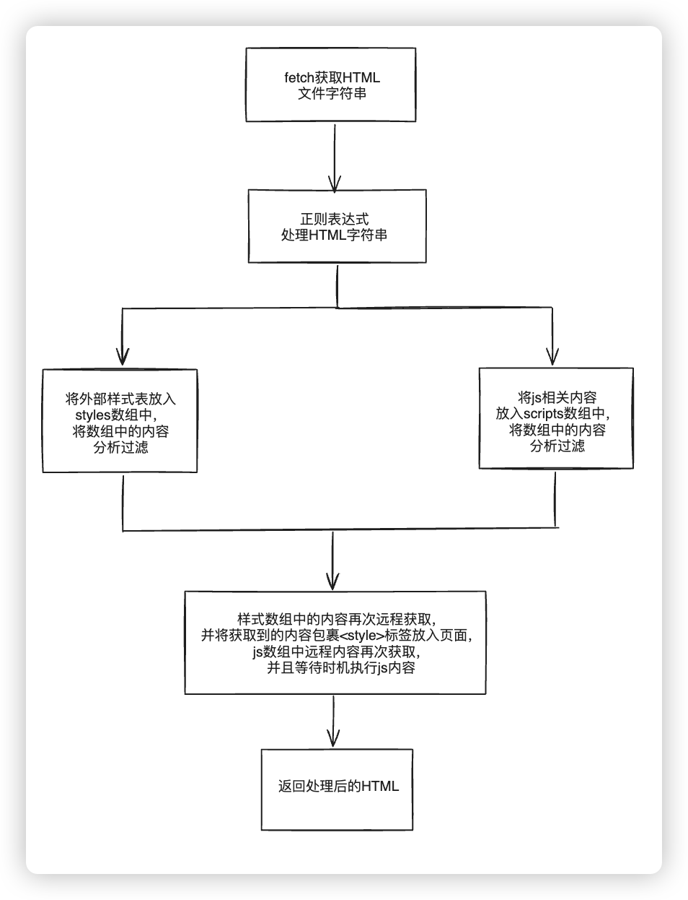

#### JS沙箱隔离

当然内容加载进来之后，肯定是会有冲突的，这种情况类似于：基座应用(主应用)向window上添加一个全局变量：`window.globalStr = "hello 基座";`，如果此时子应用也有一个相同的全局变量：`globalStr='hello 子应用'`，此时就产生了变量冲突，基座应用的变量会被覆盖。

所以，JS 沙箱做的事情可以用两句话概括：

1. 为每一个子应用创建一个专属的 “window 对象” (不是真的 window 对象)；
2. 执行子应用时，将新建的 “window 对象” 作为子应用脚本的全局变量，子应用对全局变量的读写操作都作用到这个 “window 对象”中。

JS沙箱的实现一般有种思路

- 快照沙箱

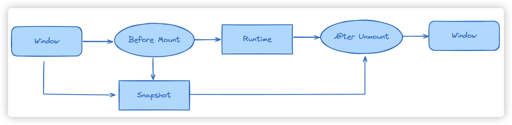

简单来说，就是在应用沙箱挂载/卸载时记录快照，依据快照恢复环境，基本实现思路是：直接用 **windows diff**。把当前的环境和原来的环境做一个比较，我们跑两个循环，把两个环境作一次比较，然后去全量地恢复回原来的环境。不过缺点非常明显，就是不支持多实例

```typescript
// 快照沙箱的简易实现
// SnapshotSandbox 能够还原 window 和记录自己以前的状态，那么就需要两个对象来存储这些信息
// 1. windowSnapshot 用来存储沙箱激活前的 window
// 2. modifyPropsMap 用来存储沙箱激活期间，在 window 上修改过的属性

// 沙箱需要两个方法及作用
// 1. sanbox.active() // 激活沙箱
//  - 保存 window 的快照
//  - 再次激活时，将 window 还原到上次 active 的状态
// 2. sanbox.inactive() // 失活沙箱
//  - 记录当前在 window 上修改了的 prop
//  - 还原 window 到 active 之前的状态

class SnapshotSandbox {
  constructor() {
    this.windowSnapshot = {}
    this.modifyPropsMap = {}
  }
  active() {
    // 1. 保存 window 的快照
    for (let prop in window) {
      if (window.hasOwnProperty(prop)) {
        this.windowSnapshot[prop] = window[prop]
      }
    }
    // 2. 再次激活时，将 window 还原到上次 active 的状态，modifyPropsMap 存储了上次 active 时在 widow 上修改了哪些属性
    Object.keys(this.modifyPropsMap).forEach(prop => {
      window[prop] = this.modifyPropsMap[prop]
    })
  }
  
  inactive() {
    for(let prop in window) {
      if (!window.hasOwnProperty(prop)) continue;
  
      if (window[prop] !== this.windowSnapshot[prop]) {
        this.modifyPropsMap[prop] = window[prop];  // 保存修改后的结果
        window[prop] = this.windowSnapshot[prop];  // 还原window
      }
    }
  }
}

```

实验：

```js
window.name = 'jack'

const ss = new SnapshotSandbox()

console.log('window.name', window.name) // jack

ss.active() // 激活

window.name = 'rose'

console.log('active: window.name ---', window.name) // rose

ss.inactive()
console.log('inactive: window.name ---', window.name) // jack

ss.active() // 再次激活
console.log('active: window.name ---', window.name) // rose
```

- Proxy代理沙箱

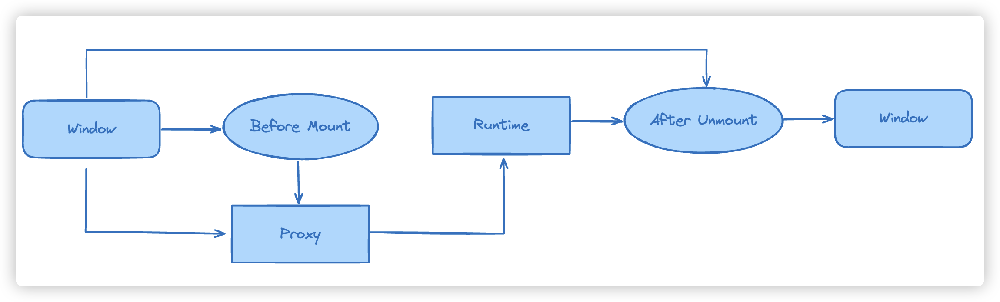

ES6 提供了新的 Proxy 在这里刚好可以用来解决这个问题，通过 Proxy 我们代理全局window：

```js
class ProxySandbox {
  constructor() {
    const rawWindow = window;
    const fakeWindow = {}
    this.proxy = new Proxy(fakeWindow, {
      set(target, p, value) {
        target[p] = value;
        return true
      },
      get(target, p) {
        return target[p] || rawWindow[p];
      }
    });
  }
}
```

实例：

```js
const sandbox = new ProxySandbox();
window.name = "jack";
console.log(window.name); // jack
((window) => {
  window.name = 'rose';
  console.log(window.name)  // rose
})(sandbox.proxy);
console.log(window.name);   // jack
```

当然，这个**Proxy代理沙箱机制**还有很多变种，比如**一般都要和`with`语句块结合**，防止变量逃逸等状况，这里就不再展开描述了

#### CSS环境隔离

在微前端框架里所面临的样式冲突器就两种：一种是**主子应用样式冲突**，你的主应用和你的子应用两者之间样式会发生冲突，另一种是**子应用之间样式冲突**，当你挂载了应用 A 又挂载了应用 B 的时候，这两个应用是平级的，它们之间样式也会发生冲突。


##### 常见样式隔离方案

|            | 说明                                  | 优点                   | 缺点                                                  |
| ---------- | ------------------------------------- | ---------------------- | ----------------------------------------------------- |
| BEM        | 不同的项目用不同的命名/前缀避开冲突   | 简单                   | 依赖约定，容易出现耦合                                |
| CSS Module | 通过编译生成不冲突的选择器名          | 可靠易用，避免人工冲突 | 只能在构建阶段使用，依赖预处理器与打包工具            |
| CSS in JS  | CSS与JS编码在一起，生成不冲突的选择器 | 基本避免冲突           | 样式是通过 JavaScript 运行时动态生成的，CSS能力较薄弱 |

##### 样式隔离方案：Shadow DOM

其实严格样是隔离代表 Shadow DOM。Shadow DOM 是可以真正的做到 CSS 之间完全隔离的，在 Shadow Boundary 这个阴影边界阻隔之下，主应用的样式和子应用的样式可以完完全全的切分开来。

但是绝大部分情况下，你还是不能无脑的开启严格样式隔离的。原因之前的同学也已经提到过一些了，比如说你在使用一些弹窗组件的时候（弹窗很多情况下都是默认添加到了 `document.body` ）这个时候它就跳过了阴影边界，跑到了主应用里面，样式就丢了。又比方说你子应用使用的是 React 技术栈，而 React 事件代理其实是挂在 `document` 上的，它也会出一些问题。所以实践里当你开启 Shadow DOM 之后，当你的子应用可能会遇到一些奇怪的错误，这些错误需要你一一的去手动修复，这是比较累的一个过程。

虽然微前端框架都有**Shadow DOM**隔离这个选项，但是知道有这个东西即可

#### 应用通信

##### 基于 URL

其实有一种最朴素的通讯方案，就是基于 URL。前端有一种设计叫做 URL 中心设计，就是说你的 URL 完全决定了你页面展示出来是什么样子。

假如我的应用里有一个列表，有一个分页，当你点下一页的时候，是不是就产生了一个在第二页的 query 参数？你可能会把这个参数同步到路由上，这样你把这个链接分享给别人的时候，别人就能看到跟你一样的页面。

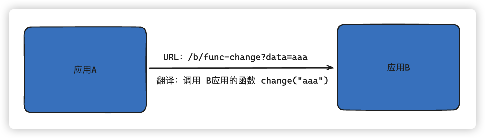

我们其实完全可以把这种**路由翻译成看作是一个函数调用**，比如说这里的路由 b/function-change，query 参数 data 是 `aaa` ，我们可以把这个路由 URL 理解为我在调用 B 应用的 `change` 函数，这就像一次函数调用一样。当我们从应用 A 跳去应用 B，对应路由发生变化的时候，就是触发了一次函数调用，触发了一次通信。

所以路由实际上也有通信的功能。这种通信方式是完全解耦的，但是缺点就是比较弱。

##### 发布/订阅模型

另一种应用间通信的模型就是我们可以挂一个**事件总线**。应用之间不直接相互交互，都统一去事件总线上**注册事件**、**监听事件**，通过这么一个发布订阅模型来做到应用之间的相互通信。

而且，window 的 `CustomEvent` 。我们可以在 window 上监听一个自定义事件，然后在任意地方派发一个自定义事件，我们可以天然的通过自定义事件来做到应用之间相互通信。

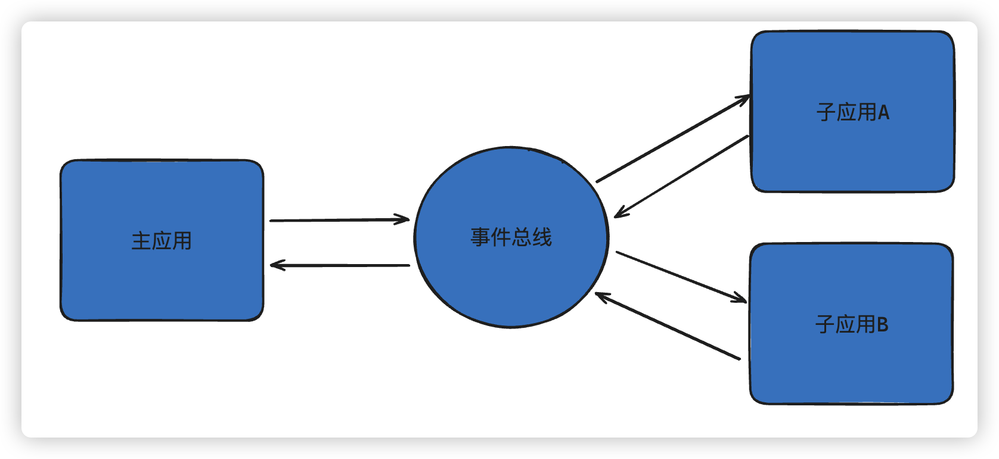

##### 基于 props

大家写过 React 或 Vue 都会知道，我们在写一个 `input` 的时候，会把 `value` 和 `onChange` 两个 `props` 都传给了底下的输入框。`qiankun`框架不是可以先进行注册吗？

那么我们在`qiankun`中也可以同样做，我们主应用是可以传递一些 `props` 给子用的。我们把 `state` 和 `onGlobalStateChange` （就是监听函数），还有我们的 `onChange` （就是 `setGlobalState` ）三个都传给子应用。我们基于 `props` 也就可以实现一个简单的主子应用之间通信。

那当我们这样子实现了主子应用之间通信之后，我们**子应用与子应用之间通信怎么做**？**让大家都跟主应用通信就行了**。**子应用和子应用之间就不要再多加一条通信链路**了，我们大家都基于 `props` 和主应用通信，这样也能解通信问题。

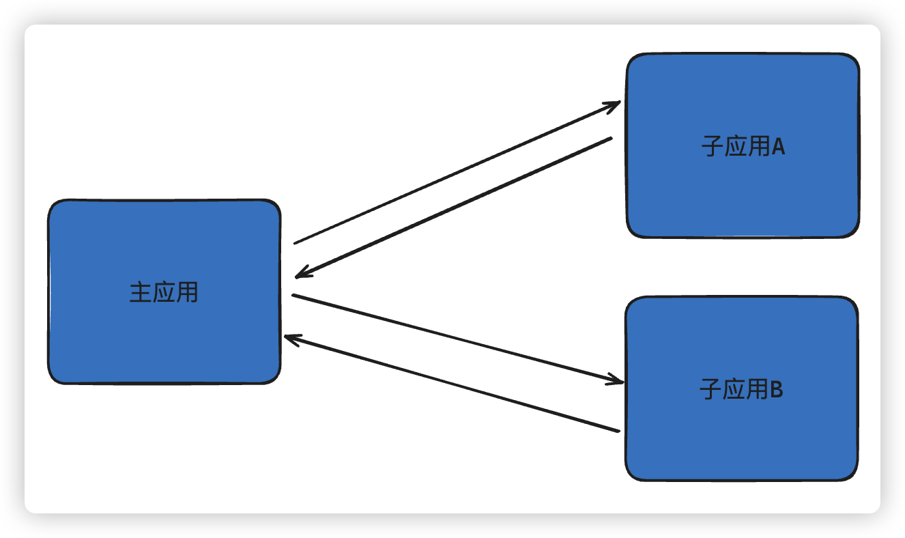

几种应用通信方式的总结：

|                     | 优点                   | 缺点                                                   |
| ------------------- | ---------------------- | ------------------------------------------------------ |
| 基于URL             | 完全解耦、应用之间独立 | 传递消息能力弱、子应用需要按照URL中心规范定义          |
| 基于CustomEvent     | 弱耦合、浏览器原生支持 | 容易出现全局命名冲突、缺乏管控、复杂情况下通信零碎散乱 |
| 基于Props           | 通信能力完全自定义     | 主子应用耦合较强、子应用之间不能直接通信               |
| 全局变量、全局Redux |                        | 强耦合、缺乏管控                                       |

#### 微前端库的技术对比

| **框架**       | **single-spa**                                               | **qiankun**                                                  | **wujie**                                                    | **micro-app**                                                |
| -------------- | ------------------------------------------------------------ | ------------------------------------------------------------ | ------------------------------------------------------------ | ------------------------------------------------------------ |
| 简介           | 开源社区，微前端鼻祖                                         | 蚂蚁，基于single-spa封装                                     | 腾讯，基于webComponent和iframe                               | 京东，基于WebComponent                                       |
| 微应用加载     | 核心是一种运行时协议，定义了主应用如何配置微应用，从而感知微应用的加载和卸载时机。 | 基于但区别与spa加载微应用方式，它采用`import-html-entry`方式加载微应用 | 基于WebComponent容器和iframe沙箱来实现微前端组件式加载。     | 借鉴WebComponent的思想，通过CustomElement结合自定义的shadow dom，将微前端封装成一个组件，来加载微应用。 |
| DOM隔离        | 无                                                           | 基于shadow dom                                               | iframe通过proxy的方法将dom劫持到shadow dom上                 | 基于shadow dom实现                                           |
| CSS隔离        | 无                                                           | 支持shadow dom和scoped css                                   | 基于iframe劫持和shadow dom                                   | 默认基于scoped css，也支持shadow dom，但官方提示对React支持不好，慎用 |
| JS隔离         | 无                                                           | 支持快照和proxy沙箱                                          | 基于iframe                                                   | 基于proxy                                                    |
| 状态管理与通信 | 无                                                           | 提供了actions全局状态管理与基于props注入通信。               | props注入基于iframe同域下的window去中心化的eventBus          | window.microApp上挂在dispatch、getData、setData等丰富api用于通信 |
| 内置生命周期   | 无                                                           | 完整的生命周期beforeLoad、beforeMount、afterMount、beforeUnmount、afterUnmount | 更完整的生命周期beforeLoad、beforeMount、afterMount、beforeUnmount、afterUnmount、activated、deactived、loadError | 较丰富的生命周期created、beforemount、mounted、unmount、error |
| 接入成本       | 高、框架过于原始，什么都要自行封装                           | 高，生命周期、路由、静态资源路径配置、webpack配置都需适配。  | 低                                                           | 低                                                           |
| 优点           | 自定义程度高                                                 | 使用最广，社区活跃，很多踩坑解决方案                         | 虽然CSS是基于shadow dom，但iframe通过proxy的方法将dom劫持到shadow dom上，达到彻底隔离vite支持友好 | 使用简单，代码无入侵，不依赖其他三方库                       |
| 坑点           | 框架过于原始，什么都要自行封装                               | css沙箱隔离不完全，严格模式基于shadow dom，第三方组件的弹窗默认挂到body下面，这样弹窗中的自定义样式会失效，需要手动设置挂载阶段样式隔离基于scoped css，对于同名样式依然存在问题不支持vite | 内存开销较大，承载js的iframe是隐藏在主应用的body下面，常驻内存不同技术栈需接入不同的包版本适配 | 样式隔离基于scoped css，对于同名样式依然存在问题浏览器兼容，WebComponentvite适配成本高 |