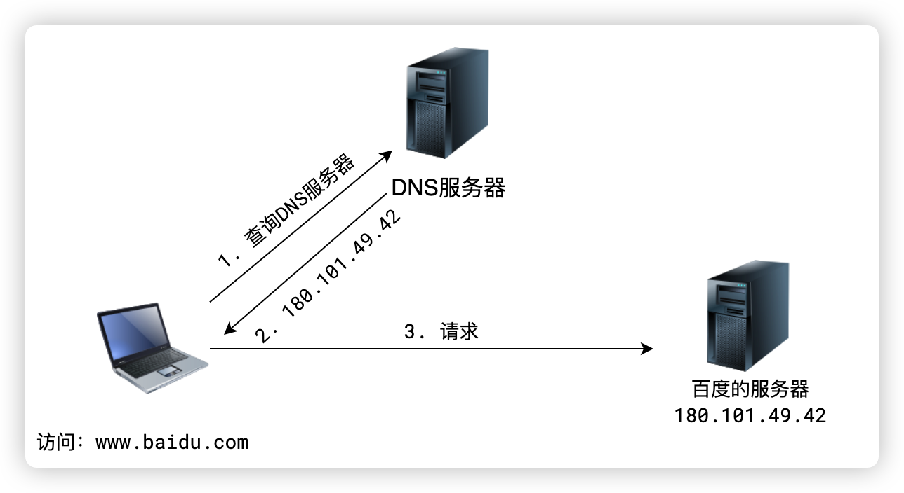
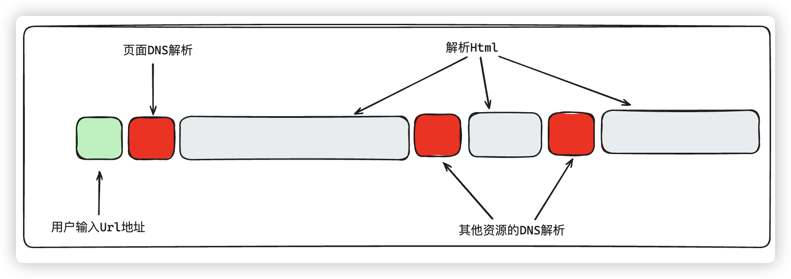
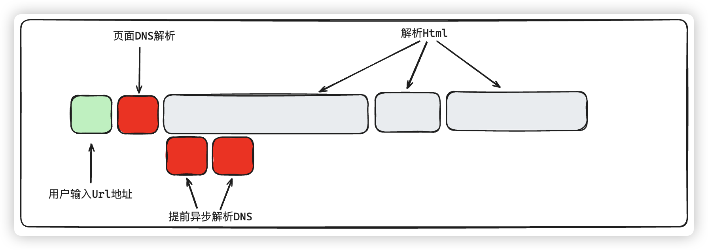
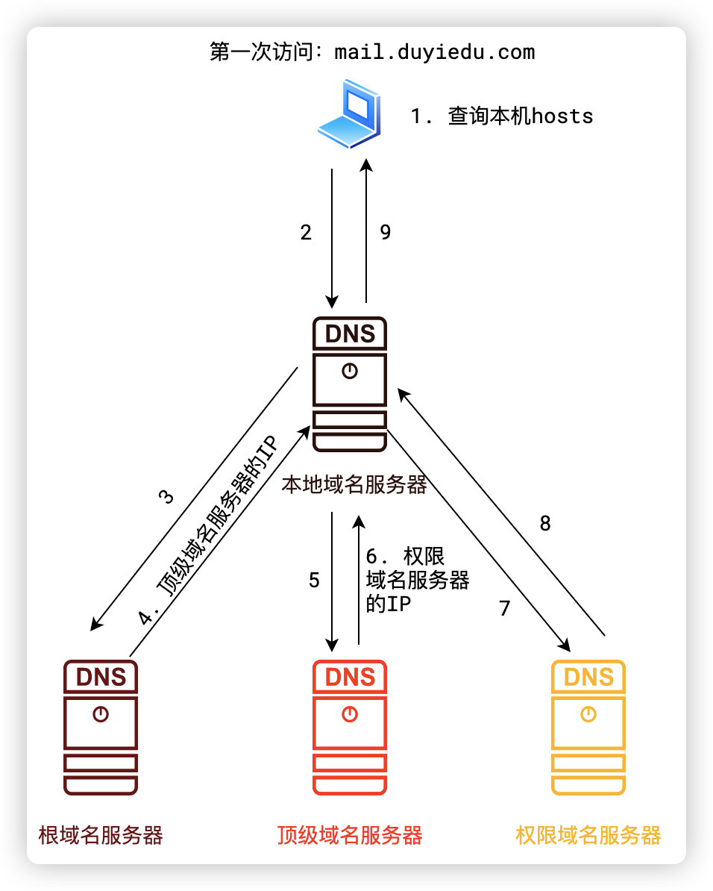

# DNS 解析和优化

# 技术讲解

## 什么问题

域名虽然有助于记忆，但是网络传输和域名没有半毛钱关系

**网络传输必须依靠 IP**

所以，必须有一个东西，能够将域名转换成 IP 地址，这个东西就是 DNS 服务器，翻译成 IP 地址的过程称之为**域名解析**



DNS 解析虽然有缓存，但是在第一次的时候无论如何都是一个耗时的操作



在浏览器解析 html 的时候，会遇到一些 script 元素、link 元素，此时会暂停 html 的解析，转而加载 JS，里面就包含了 DNS 解析，这个过程是耗时的，会阻塞浏览器渲染主线程，因此，我们可以想办法优化 DNS 解析，避免用户第一次打开我们页面的时候，DNS 耗时操作产生卡顿或者白屏的情况

## 解决思路

可以使用**DNS 预解析**

**DNS 预解析**（`dns-prefetch` ）是前端网络性能优化的一种措施，它根据浏览器定义的规则，提前解析之后可能会用到的域名，使解析结果缓存到系统缓存中，缩短 DNS 解析时间，进而提高网站的访问速度。

DNS 预解析能够让浏览器在用户访问链接之前解析域名，域名解析后，如果用户确实访问该域名，那么 DNS 解析时间将不会有延迟。因为预读取会在后台执行，这能够减少用户具体操作时候的延迟感。



## 解决细节

### DNS 预解析的原理

当浏览器访问一个域名的时候，需要解析一次 DNS，获得对应域名的 ip 地址；在解析过程中，按照如下的顺序逐步读取缓存，直到拿到 IP 地址：

1. 查找本机 hosts 文件中是否有解析记录，如果有，直接使用
2. 查找本地域名服务器中是否有解析记录，如果有，直接使用
3. 查询根域名服务器，得到顶级域名服务器 ip
4. 查询顶级域名服务器中是否有解析记录，如果有，直接使用
5. 根据顶级域名服务器反馈的 ip，查询权限域名服务器，如果有解析记录，直接使用
6. 如果以上都找不到，域名解析失败



### 开启预解析

开启预解析很简单，使用`link`标签的`rel="dns-prefetch"`属性即可，将我们需要解析的域名统统提到最前面即可，浏览器在一开始就看到了这个标签，就可以异步的去解析这个域名，这样就减少了用户第一次访问我们站点的时候白屏的情况，或者说具体操作的时候一些延迟情况。

```html
<link rel="dns-prefetch" href="https://www.baidu.com" />
```

### 工程化环境中的问题

我们现在的开发都是在一个工程化环境中，不可能像我们测试的时候，一些链接都是分布在不同的组件中。甚至是不同的人开发的组件内容。因此，如果我们希望优化 DNS 解析，就应该在工程化环境中，自动的完成该处理。

#### 分析

工程化环境是很复杂的，不同的前端框架，不同的脚手架，如果从框架层面出发，那么出发点一开始就错了。

如果我们的源码是用 react 写的，还是 Vue2，Vue3 写的，最终的包结果是差不多的，无论如何，打包之后都是 Html，css 和 js。所以，我们思考做事的出发点，就应该是在打包结果里面做事情，当完成打包之后，分析打包结果，在打包之后的 css，js 代码中有没有外链接。把这些内容提取出来，拼接成`link`标签，加上`rel`属性`rel="dns-prefetch"`，放到最后打包的 html 中去即可

```js
// 在 dist 目录下的所有 HTML 文件 <head> 标签里，自动插入 <link rel="dns-prefetch" href="...">，用于预取外部域名，提高页面加载性能。
const fs = require("fs");
const path = require("path");
const { parse } = require("node-html-parser");
const { glob } = require("glob");
const urlRegex = require("url-regex");

// 获取外部链接的正则表达式
const urlPattern = /(https?:\/\/[^/]*)/i;
const urls = new Set();
// 遍历dist目录中的所有HTML、js、css文件
async function searchDomain() {
  const files = await glob("dist/**/*.{html,css,js}");
  for (const file of files) {
    const source = fs.readFileSync(file, "utf-8");
    const matches = source.match(urlRegex({ strict: true }));
    if (matches) {
      matches.forEach((url) => {
        const match = url.match(urlPattern);
        if (match && match[1]) {
          urls.add(match[1]);
        }
      });
    }
  }
}

async function insertLinks() {
  const files = await glob("dist/**/*.html");
  const links = [...urls]
    .map((url) => `<link rel="dns-prefetch" href="${url}" />`)
    .join("\n");

  for (const file of files) {
    const html = fs.readFileSync(file, "utf-8");
    const root = parse(html);
    const head = root.querySelector("head");
    head.insertAdjacentHTML("afterbegin", links);
    fs.writeFileSync(file, root.toString());
  }
}

async function main() {
  await searchDomain();
  // 在<head>标签中添加预取链接
  await insertLinks();
}

main();
```

调用：

```js
"scripts": {
  "build": "vite build && node ./scripts/dns-prefetch.js",
},
```
