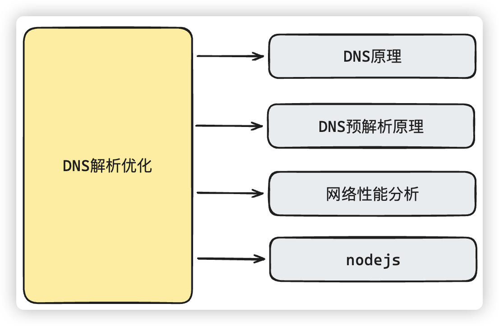
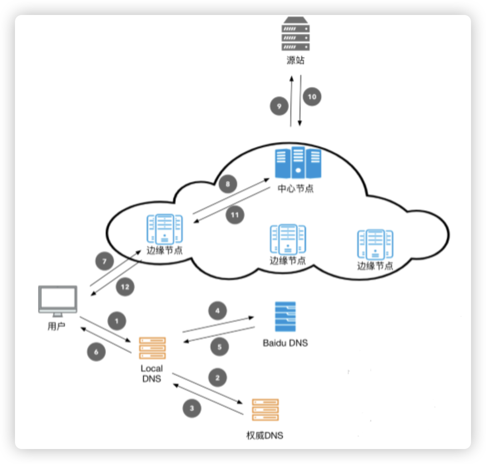

# DNS解析与优化

# 面试讲解

## 知识点图谱

这个问题本身处理办法比较简单明了，但是难点其实在于网络的了解，对于网络性能分析的掌握，对于打包工具的和nodejs的了解，才会比较简单明了的分析出问题所在，并且解决问题：

## 难点描述

**模拟问题：**我看你的简历里面写了专门对于DNS解析优化的处理，并且提升了首次访问速度，能讲一下怎么做的吗？

> **问题分析:**
>
> 这个问题本身当然是讲解问题解决办法，但是我们在讲解这个问题的时候，最好从问题出现开始，分析解决问题的过程，然后给出解决办法。最终的解决办法其实并不难，难的是分析处理问题的能力，而且这个问题最好在回答的时候给面试官埋好钩子，引导面试官提出你想要的回答的问题：
>
> 1、问题背景
>
> 2、方案选择，为什么选择这种方案或者思考过程
>
> 3、实现细节，具体如何实现
>
> 4、最终落地效果
>
> **参考答案：**
>
> **用户第一次访问，FCP时间和白屏时间，是我们在开发之后，优化测试比较看重的一点，当然涉及到首页白屏时间的因素比较多，就单从网络方面来考虑，无非就是DNS，http缓存，cdn等等这些。所以首先考虑的就是这个DNS有没有可以优化的点。**
>
> 因为我们的工程中存在外链接，通过网络测试的分析(测试的时候可以通过chrome浏览器network标签看到具体)，可以很明显的看到第一次访问站点的时候，在浏览器解析HTML的时候，一些外链接的加载，特别浏览器也是第一次遇到这些域名，同样需要解析域名的操作。如果是比较大的图片，就会加载的比较慢，css可能会影响页面的效果，特别是如果涉及到js的加载，还会影响浏览器的继续渲染。那这个就是我们可以优化的点。
>
> 而且主要是这种优化比较简单，我们只需要把这种解析提前就可以了，使用`link`标签的`rel="dns-prefetch"`属性即可。
>
> 但是在项目中的难点在于，这些链接是存在于不同的组件中的，人工手动的去做这些处理肯定不现实，因此最好通过程序自动的来处理。所以问题的关键点在于，怎么处理？
>
> 由于在工程化环境里面，不同的前端框架，不同的脚手架，我们不可能从源码的部分处理。但是好在源码最终是需要打包的。无论是`webpack`还是`vite`(**埋钩子：面试官可能会追问webpack与vite有什么区别？**)，打包之后都是Html，css和js。所以，我们思考做事的出发点，就应该是在打包结果里面做事情，当完成打包之后，分析打包结果，在打包之后的css，js代码中有没有外链接。把这些内容通过**nodejs脚本**提取出来，放到最后打包的html中去即可
>
> **通过这么处理之后**，效果很明显，假如浏览器首次将一个域名解析为 IP 地址，并缓存至操作系统，那么下一次 DNS 解析时间可以低至 0-1ms；倘若结果不缓存在系统，则需要读取运营商DNS缓存，一般常见的域名，读取ISP（运营商）DNS 缓存需要的时间在 80-120ms，如果是不常见的域名，平均需要 200-300ms
>
> 那也就是说，一个`dns-prefetch` 就可以给 DNS 解析过程带来 15-300ms 的提升，如果大量引用很多其他域名资源的网站，提升效果就更加明显了
>
> **(如果有把握，埋钩子，引导面试官追问更多的问题)**
>
> 当然了，DNS缓存之后，就仅仅网络层面的优化还有很多，比如http缓存，cdn等等，http缓存虽然前端不会直接控制，不过我们前端一般会利用http缓存的机制处理问题，比如**打包时候的文件指纹，比如对于webpack的代码分割就是利用了http缓存机制**(**埋钩子：注意可能会被问到webpack代码分割相关问题，需准备**)，对于那些不会经常改变的第三方库进行单独的代码分割处理，来避免因为发布更新导致没有发生更改的第三方依赖被重复请求

## 知识点叙述

### 1、基础概念性问题

**模拟问题：** 什么是DNS？

> **问题分析:**
>
> 非常基础的问题，但是既然说到了优化DNS，这个问题应该也是逃不掉的，回答的基本格调就是简单快速明确的回答出DNS是什么即可，而且，必须要有自己的总结归纳，不然就像在背书
>
> **参考答案：**
>
> DNS的作用简单来说，其实就是域名通过DNS服务器进行查找转换，转换成具体的IP地址。具体的转换过程其实就是从本机开始，浏览器 DNS 缓存、hosts 文件、系统 DNS 缓存，然后再到本地 DNS 服务器，再到根域名服务器，顶级域名服务器，一级一级的查询最终的 IP。
>
> 所以这个这个过程肯定是**耗时**的，当然好在DNS是有**缓存**的，第一次访问完成之后，再此访问就可以直接从缓存中读取了，所以我们这个处理，说白了，就是让本机先缓存DNS

**模拟问题：**CDN和DNS有什么关系？

> **参考答案：**
>
> (**注意：请提前了解CDN的基本常识**)
>
> CDN服务本身并不具备DNS解析功能，而是依托于DNS智能解析功能，由DNS根据用户所在地、所用线路进行智能分配最合适的CDN服务节点，然后把缓存在该服务节点的静态缓存内容返回给用户，所以在启用CDN后进行ping查询时IP发生了变化。

**模拟问题： ** **script**中的`async`和`defer`与**link**标签中`prefetch`和`preload`分别表示什么意思？

> 基础性的问题
>
> **参考答案：**
>
> `<script>`加入**defer**属性后，即使把`<script>`标签放入`<head>`也不会阻塞后面DOM的解析，而且脚本会延迟到整个DOM解析完后在去执行。也就是`<script>`标签加入defer属性会告诉`浏览器立即下载脚本，但是延迟执行脚本`。
>
> `<script>`标签加入**async**属性会告诉**浏览器立即下载脚本，哪个脚本先加载完就先执行，而且是加载完就立马执行**。如果有DOM正在解析，会阻塞解析。
>
> **prefetch**是一种浏览器机制，利用浏览器空闲时间来下载后续可能需要使用的资源。在浏览器完成当前页面的加载后开始静默地拉取指定的文档并将其存储在缓存中。
>
> **preload**就是希望浏览器尽早的请求资源，且不阻塞正常的onload。
> `<link rel="preload" href="xxx" as="xxx"/>`
>
> **preload**必须设置**as**属性来声明资源的类型（font/image/style/script等)，否则浏览器可能无法正确加载资源。对于字体文件或者可以加载的跨域资源需要加上crossorigin属性。
>
> 在`webpack`项目中，可以通过在路由配置`/* webpackPrefetch: true */`，或者`/* webpackPreload: true */`开启路由相关js的link属性处理

### 2、扩展问题

**模拟问题：**在网络方面的优化，除了DNS你还做了哪些优化？

> **问题分析:**
>
> 主要考察你的网络知识掌握情况
>
> **参考答案：**
>
> 在网络方面，对于我们影响比较大的还有http缓存或者启用http2(**注意：可能会被问到相关知识点，比如强缓存，协商缓存，以及http2的相关知识点。需要准备**)，当然还有CDN，不过对于前端来说除了注意CDN容灾的处理(**注意：这里会被问到相关知识点**)

**模拟问题：**具体是怎么在工程化环境中解决DNS优化的问题的？

> **问题分析:**
>
> 简要说明一下代码实现步骤即可
>
> **参考答案：**
>
> 基本的思路是使用第三方依赖`glob`函数来获取打包结构中的html，js和css文件，然后通过正则表达式遍历出有用的内容，放入到set集合中，保证不重复。
>
> 然后把集合中的内容读出来，生成`link`元素，然后再加入到打包结果的`head`元素中去，由于我们是node环境处理，所以需要一些处理在node环境中把html内容读取出来并插入进去就完事了。
>
> 当然最后就是我们打包完成之后运行相关的脚本就行了。
