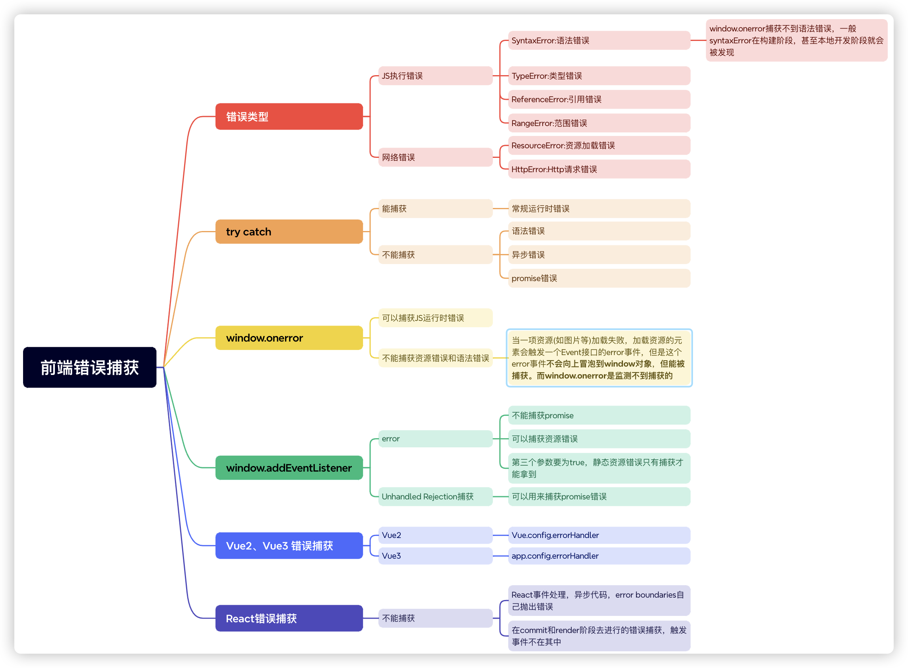

# 前端监控

# 技术讲解

## 什么问题

运营与产品团队需要关注用户在产品内的行为记录，通过用户的行为记录来优化产品。

研发与测试团队则需要关注产品的性能以及异常，确保产品的性能体验以及安全迭代。

我们就需要在用户端进行监测，当然主要目的是为了让我们的产品更完善，更符合我们和用户的需求

## 解决思路

一个完善的前端监控产品实际是一个比较庞大的体系，**数据采集与上报、数据整理和存储、数据展示**。有前端要处理的问题，还需要专门的后端数据中心，是十分麻烦的，所以要做前端监控的话，在企业的层面，首先要做好的是成本的估算。**到底是使用现成的产品？还是自己开发一套？**所以，一般中小型企业要谨慎选择！我的意思是，在我们的项目简历中，需要考虑到这一点。当然，我们也可以把前端监控做减法，因为不需要监控那么多的内容，只是造轮子做其中几块内容监控，这样拿出来说，也不是不行。

现在有很多比较成熟的前端监控的产品

1、[sentry](https://sentry.io/welcome/)

2、灯塔

3、[阿里ARMS](https://www.aliyun.com/product/arms)

4、神策

......

有一些是可以免费试用的，如果同学们不是太清楚前端监控在干什么，我们可以把自己的项目拿来做做实验，做一个大概的了解。

基本上，都是在做下面的一些事情

- `页面的性能情况`：包括各阶段加载耗时，一些关键性的用户体验指标等

- `用户的行为情况`：包括PV、UV、访问来路，路由跳转等

- `接口的调用情况`：通过http访问的外部接口的成功率、耗时情况等

- `页面的稳定情况`：各种前端异常等

- `数据上报`：如何将监控捕获到的数据上报

上面已经提到，其实完整的监控平台至少分为三大类

- **数据采集与上报**
- 数据整理和存储(后端数据中心)
- 数据展示(表格，图表等分析数据展示)

一般情况下，**数据的采集与上报，我们都会做成单独的SDK**，产品直接引用就可以了。

无论性能，行为还是异常情况，引入到产品中的监控SDK就可以帮我们监听这些内容。那么具体监听的手段其实就被称之为**前端埋点**。

前端埋点还分为**手动埋点**和**无痕埋点**。

**手动埋点**，就是在要监听的项目中的某段代码或者某个事件中加入一段监听SDK代码，然后对监听的内容进行上报，好处就是可以对关键性行为做出具体的跟踪，坏处是具有侵入性

**无痕埋点**，就是就是对监听的项目进行全部无脑监听，比如点击事件，滚动事件等等，只要触发了就上报。好处就是对代码没有侵入性，坏处当然也很明显无法快速定位关键信息，上报次数多，服务器压力大

## 解决细节

### 错误监控

虽然在我们开发完成之后，会经历多轮的`单元测试`、`集成测试`、`人工测试`，但是**难免漏掉一些边缘的测试场景**，甚至还有一些`奇奇怪怪的玄学故障出现`；而出现报错后，`轻则某些数据页面无法访问`，`重则导致客户数据出错`；

因此，我们的前端监控，需要对前端页面的错误进行监控，一个强大完整的错误监控系统，可以帮我们做以下的事情：

- 应用报错时，及时知晓线上应用出现了错误，及时安排修复止损；
- 应用报错后，根据上报的用户行为追踪记录数据，迅速进行bug复现；
- 应用报错后，通过上报的错误行列以及错误信息，找到报错源码并快速修正；
- 数据采集后，进行分析提供宏观的 错误数、错误率、影响用户数等关键指标；



### 数据上报

#### ajax

ajax上报这种方式存在很大的问题。

1. **浏览器的安全策略：**由于浏览器的安全策略，Ajax 请求可能会受到同源策略限制。
2. **页面卸载时的数据上报：**如果使用异步的 XMLHttpRequest 或 fetch 发送 Ajax 请求进行数据上报，由于这些请求是异步的，可能会导致在页面卸载时尚未完成请求，从而导致数据丢失。当然，我们可以使用同步的 `XMLHttpRequest`来简单解决这个问题
3. **阻塞页面卸载：**如果在页面卸载时，当前页面仍在发送 Ajax 请求，这些请求可能会阻塞页面的卸载，导致页面无法正常关闭，从而影响用户体验。

#### Navigator.sendBeacon

[navigator.sendBeacon()](https://developer.mozilla.org/zh-CN/docs/Web/API/Navigator/sendBeacon)方法可用于通过 [HTTP POST](https://developer.mozilla.org/zh-CN/docs/Web/HTTP/Methods/POST) 将少量数据 [异步](https://developer.mozilla.org/zh-CN/docs/Glossary/Asynchronous) 传输到 Web 服务器。

它主要用于将统计数据发送到 Web 服务器，同时避免了用传统技术（如：[`XMLHttpRequest`](https://developer.mozilla.org/zh-CN/docs/Web/API/XMLHttpRequest)）发送分析数据的一些问题。

使用 **`sendBeacon()`** 方法会使用户代理在有机会时异步地向服务器发送数据，同时不会延迟页面的卸载或影响下一导航的载入性能，这意味着：

- 数据发送是可靠的。
- 数据异步传输。
- 不影响下一导航的载入。

#### 图片打点上报的方式

其实除了传统的ajax方式，以及`Navigator.sendBeacon()`方式，还可以采用图片打点上报的方式。

这种方式可以避免页面切换阻塞的问题，但是缺点也很明显：

1、由于是url地址传值，所以传值的数据长度有限

2、地址传递需要后端单独做处理

#### 延迟上报

还有一种情况，如果大量的问题需要上传，比如用户疯狂点击出现错误情况，那么每次上报这种情况也不太好，因此做一下延迟上报处理，也很有必要。

### 页面性能监控

我们都听说过性能的重要性。但当我们谈起性能，以及让网站"速度提升"时，我们具体指的是什么？

`其实性能是相对的`：

- 某个网站可能对一个用户来说速度很快（网速快，设备强大的情况下），但可能对另一个用户来说速度很慢（网速慢，设备低端的情况下）。
- 两个网站完成加载所需的时间或许相同，但其中一个却 **显得** 加载速度更快（如果该网站逐步加载内容，而不是等到最后才一起显示）。
- 一个网站可能 **看起来** 加载速度很快，但随后对用户交互的响应速度却很慢（或根本无响应）。

因此，在谈论性能时，重要的是做到精确，并且根据能够进行定量测量的客观标准来论及性能。这些标准就是 **指标**。

如果仅仅是开发者自己在测试的时候，用浏览器测试一下，这当然也是**指标**，但是这种指标只能算是**实验室数据**，而真正需要的是客户端的大量数据指标

**`前端性能监控，就是要监测页面的性能情况，将各种的性能数据指标量化并收集`**

#### Lighthouse灯塔

**Lighthouse** 是一个网站性能测评工具， 它是 Google Chrome 推出的一个开源自动化工具。能够对网页多方面的效果指标进行评测，并给出最佳实践的建议以帮助开发者改进网站的质量。它的使用方法也非常简单，我们只需要提供一个要测评的网址，它将针对此页面运行一系列的测试，然后生成一个有关页面性能的报告。通过报告我们就可以知道需要采取哪些措施来改进应用的性能和体验。

在高版本（ >= 60）的 Chrome 浏览器中，**Lighthouse** 已经直接集成到了调试工具 **DevTools**中了，因此不需要进行任何安装或下载。


**Lighthouse 能够生成一份该网站的报告，比如下图：**


#### Performance 寻找性能瓶颈

打开 Chrome 浏览器控制台，选择`Performance`选项，点击左侧`reload图标`


#### W3C标准化

官方地址：[Navigation Timing Level 2](https://www.w3.org/TR/navigation-timing-2/)

为了帮助开发者更好地衡量和改进前端页面性能，`W3C性能小组`引入了 `Navigation Timing API` ，实现了自动、精准的页面性能打点；开发者可以通过 `window.performance` 属性获取。


`图中指标的解读`可以在 [developer.mozilla.org/zh-CN/docs/…](https://developer.mozilla.org/zh-CN/docs/Web/API/PerformanceTiming) 中查看

一大堆的变量和不知道的计算规则，你不用纠结这一堆，因为**已经被废弃了**。

**w3c level2** 扩充了 `performance` 的定义，并增加了 `PerformanceObserver` 的支持。

#### [PerformanceObserver](https://developer.mozilla.org/zh-CN/docs/Web/API/PerformanceObserver)

**`PerformanceObserver`** 用于*监测*性能度量事件，在浏览器的性能时间轴记录新的 [performance entry](https://developer.mozilla.org/zh-CN/docs/Web/API/PerformanceEntry) 的时候将会被通知。

简单来说，我们只需要指定预定的[entryType](https://developer.mozilla.org/zh-CN/docs/Web/API/PerformanceEntry/entryType)，然后就能通过PerformanceObserver的回调函数获取相应的性能指标数值

```typescript
new PerformanceObserver((entryList) => {
  for (const entry of entryList.getEntriesByName('first-contentful-paint')) {
    console.log('FCP candidate:', entry.startTime, entry);
  }
}).observe({type: 'paint', buffered: true});
```

那么关键点来了，性能指标到底有些啥，每个性能指标有什么作用？

w3c制定了一大堆指标，不过google发布了`web-vitals` ，它是一个开源的用以衡量性能和用户体验的工具，对于我们现在来说，这个开源工具中所提到的指标已经足够用了。而且现在本身也是业界标准

#### [web-vitals](https://web.dev/metrics/)

##### [以用户为中心的性能指标](https://web.dev/user-centric-performance-metrics/)

什么叫以用户为中心的性能指标呢？其实就是可以直接的体现出用户的使用体验的指标；目前 `Google` 定义了`FCP`、`LCP`、`CLS` 等体验指标，

对于用户体验来说，指标可以简单归纳为 `加载速度`、`视觉稳定`、`交互延迟`等几个方面；

- `加载速度` 决定了 **用户是否可以尽早感受到页面已经加载完成**
- `视觉稳定` 衡量了 **页面上的视觉变化对用户造成的负面影响大小**
- `交互延迟` 决定了 **用户是否可以尽早感受到页面已经可以操作**

##### [什么是 FCP？](https://web.dev/fcp/)

首次内容绘制 (FCP) 指标测量页面从开始加载到页面内容的任何部分在屏幕上完成渲染的时间。对于该指标，"内容"指的是文本、图像（包括背景图像）、`<svg>`元素或非白色的`<canvas>`元素。


在上方的加载时间轴中，FCP 发生在第二帧，因为那是首批文本和图像元素在屏幕上完成渲染的时间点。

您会注意到，虽然部分内容已完成渲染，但并非所有内容都已经完成渲染。这是*首次*内容绘制 (FCP) 与*Largest Contentful Paint 最大内容绘制 (LCP)*（旨在测量页面的主要内容何时完成加载）之间的重要区别。


**怎样算是良好的 FCP 分数？**

为了提供良好的用户体验，网站应该努力将首次内容绘制控制在**1.8 秒**或以内。为了确保您能够在大部分用户的访问期间达成建议目标值，一个良好的测量阈值为页面加载的**第 75 个百分位数**，且该阈值同时适用于移动和桌面设备。

##### [什么是 LCP？](https://web.dev/lcp/)

最大内容绘制 (LCP) 指标会根据页面[首次开始加载](https://w3c.github.io/hr-time/#timeorigin-attribute)的时间点来报告可视区域内可见的最大[图像或文本块](https://web.dev/lcp/#what-elements-are-considered)完成渲染的相对时间。


**哪些元素在考量范围内**

根据当前[最大内容绘制 API](https://wicg.github.io/largest-contentful-paint/)中的规定，最大内容绘制考量的元素类型为：

- ``元素
- 内嵌在`<svg>`元素内的`<image>`元素
- `<video>`元素（使用封面图像）
- 通过[`url()`](https://developer.mozilla.org/docs/Web/CSS/url())函数（而非使用[CSS 渐变](https://developer.mozilla.org/docs/Web/CSS/CSS_Images/Using_CSS_gradients)）加载的带有背景图像的元素
- 包含文本节点或其他行内级文本元素子元素的[块级元素](https://developer.mozilla.org/docs/Web/HTML/Block-level_elements)。


.......这里就不在一一拷贝这里内容了，大家可以自行去查看文档

### 用户行为监控

**用户关键行为相关的埋点类型**：

- 页面埋点：统计用户进入或离开页面的各种维度信息，如页面浏览次数（PV）、页面停留时间、路由切换等。
- 事件埋点：统计用户在应用内的每一次点击事件，如新闻的浏览次数、文件下载的次数、推荐商品的命中次数等
- 曝光埋点：统计具体区域是否被用户浏览到，如活动的引流入口的显示、投放广告的显示等。

#### PV、UV

PV(page view) 是页面浏览量，UV(Unique visitor)用户访问量。PV 只要访问一次页面就算一次，UV 同一天内多次访问只算一次。

对于前端来说，只要每次进入页面上报一次 PV 就行，UV 的统计可以放在服务端来做

#### 页面停留时长

用户进入页面记录一个初始时间，用户离开页面时用当前时间减去初始时间，就是用户停留时长。这个计算逻辑可以放在 `beforeunload` 事件里做。

##### 页面跳转

利用 `addEventListener()` 监听 `popstate`、`hashchange` 页面跳转事件。需要注意的是调用`history.pushState()`或`history.replaceState()`不会触发`popstate`事件。只有在做出浏览器动作时，才会触发该事件，如用户点击浏览器的回退按钮（或者在Javascript代码中调用`history.back()`或者`history.forward()`方法）。同理，`hashchange` 也一样。

##### Vue 路由变更

Vue 可以利用 `router.beforeEach` 钩子进行路由变更的监听。

#### 页面重要区域监控

这个一般都需要进行手动埋点了，具体的页面进行监控，常常会用到Web API 的几个**Observer**，[MutationObserver](https://developer.mozilla.org/zh-CN/docs/Web/API/MutationObserver)，[IntersectionObserver](https://developer.mozilla.org/zh-CN/docs/Web/API/IntersectionObserver)，[ResizeObserver](https://developer.mozilla.org/zh-CN/docs/Web/API/ResizeObserver)

### 错误还原

这个一般都是通过sourcemap还原与前端录屏来实现

我们的项目想要部署上线，就需要将项目源码经过`混淆`、`压缩`、`babel编译转化`等等的操作之后，生成最终的`打包产物`，再进行线上部署；而这样`混淆后的代码`，我们基本上无法阅读，**即使在上文的错误监控里，我们获取了报错代码的行号、列号等关键信息，我们也无法找到具体的`源码位置所在`**；这个时候就需要 `Sourcemap` 

**`Sourcemap` 本质上是一个信息文件**，里面储存着代码转换前后的对应位置信息。它记录了转换压缩后的代码所对应的转换前的源代码位置，是源代码和生产代码的映射，一般我们通过打包工具，进行配置之后，就能得到相应的`.map`文件。

当然，**.map文件肯定不能部署到线上地址**，一般比较简单的做法是在专门的监控平台**手动上传到监控平台的形式去进行错误的分析定位**

前端录屏的实现方式有很多，这里介绍的是[rrweb](https://github.com/rrweb-io/rrweb/blob/master/README.zh_CN.md)

**rrweb**全称 `'record and replay the web`'，是当下很流行的一个录制屏幕的开源库。与我们传统认知的录屏方式（如 WebRTC）不同的是，rrweb 录制的不是真正的视频流，而是一个记录页面 DOM 变化的 JSON 数组，因此不能录制整个显示器的屏幕，只能录制浏览器的一个页签。

### 监控告警

- `宏观告警` 更加关注的是：一段时间区间内，新增异常的数量、比率是否超过了阈值；如果超过了那就进行告警；
- `微观告警` 更加关注的是：是否有新增的、且未解决的异常；

整体来说，无论宏观还是微观告警，前端不需要做太多处理。异常信息发送的后端之后，通过后端验证。如果是宏观告警，后端会进行告警收集，超过阈值进行告警。

如果是微观告警，异常信息发送的后端之后，通过后端验证是否是新的异常，只要出现的新异常，它的 uid 是当前已激活的异常中全新的一个；那么后端就进行告警。
