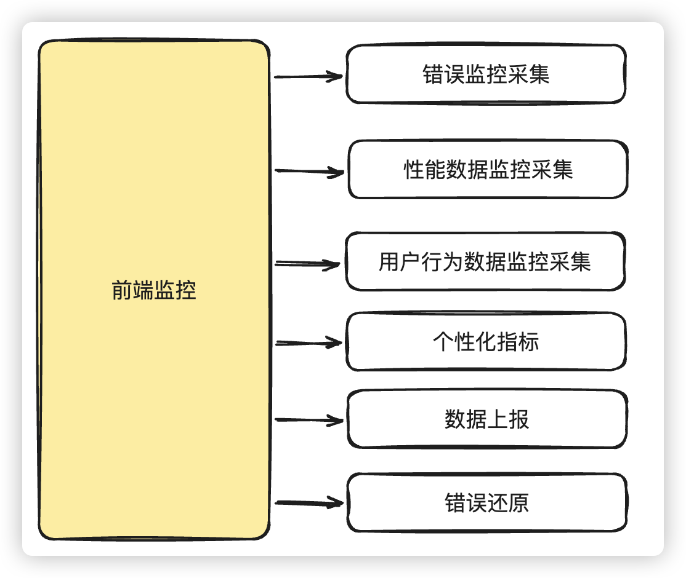

# 前端监控

# 面试讲解

## 知识点图谱

前端监控包括很多方面，每个一个方面都会有相应的知识点，而且涉及的知识点是随着它的完整度边界不断增加的，

> 所以，需要注意的是，**像这种涵盖面广泛的难点亮点，一开始一定要拔高思考角度**，站在公司端，产品端，业务端，架构端的角度的去回答问题。
>
> **面试的讲述，不要一上来就深入到细节，无论是你自己讲解，还是面试官提问。**你要引导面试官到正确的大路口
>
> 一方面**不会给面试官带来太大的记忆点**，说的越多越细，给面试官的记忆点就越分散，特别是自己如果口才不够好的话。就像我们给别人指路一样，你把细节絮絮叨叨说一堆，其实问路人根本不知道你在说什么。因为问路人脑子里根本没有地图。你只需要指明大道，某个路口，标志性建筑，至于继续怎么做，走到了那里再去问吧。
>
> 另一方面，**也容易被面试官带偏**，有些词语的表达，有些细节的实现，反而会让面试官觉得你知识掌握不牢，你这样实现不好，各种挑刺，降低印象分

一般来说，一个比较简单的前端监控，应该会涉及到以下的一些内容

## 难点描述

**模拟问题：**我看到你这个项目里面，使用了前端监控，为什么你们公司要自研前端监控呢？

> **问题分析**
>
> 注意这里只是一个模拟提问，有可能面试官一开始对于前端监控是具体的知识点的问题，也有可能是想考察你对前端监控整个体系的理解，当然也有可能是表示疑惑，你是否真正做过前端监控。
>
> 无论如何，我们的描述应该说明下面几个问题：
>
> 1、为什么会自研前端监控
>
> 2、前端监控的范围，和主要监控的目的
>
> 通过这些问题的描述，一方面确立项目的真实性，另一方面表明我们自己对前端监控整个体系的了解。
>
> 当然面试官很有可能看到你简历中有前端监控相关的难度亮点，上来就直接问你具体问题。无论怎么样为什么要自研前端监控都要简短的说明一下。
>
> 有时候当面试官一上来就问你一些比较尖锐问题的时候，实际已经和你站到了对立面，除非你能直接KO他，不然更好的办法就是从简短的语言表述中，慢慢的获取信任度，加深面试官的印象。
>
> **参考答案**
>
> 我们这个项目的前端监控，本身开始出于成本考虑，想直接使用现有的前端框架比如`sentry`，还有云平台的产品，这些我们都测试试用了一下，不过领导主要觉得别人的产品始终达不到自己想要的效果，并不能很好的让线上的产品达到**从被动转为主动**，需要的是监控产品**能聚焦公司内部产品需要的指标，能主动的发现问题，主动的明确产品优化的方向**。
>
> 完善的前端监控是一个比较大的产品，无论前端还是后端，而且**前端监控是个非功能性的需求，具有一定的架构滞后性**，而且公司**其他产品业务系统，一开始并不是有很强的意愿在前端监控上买单**，特别是**相关的业务埋点**，因为**工作量和风险不可控**。
>
> 所以，我们公司的前端监控并没有把这个产品的边界延伸的太宽。前端的话，在**监控SDK方面**还是比较常见的**错误，页面性能，用户行为等等相关的监控，以及相关数据上报**
>
> 不过其实**后端也有很多事情要处理，比如数据的加工，清洗和聚合**。这方面需要经常和后端进行沟通
>
> 在监控展示方面主要是对后端处理的数据进行综合展示，我们的**做法基本就两大块**，一块是产品业务关心的数据，还有一部分是开发测试关心的数据。
>
> **(总结：)**使用了自研的前端监控之后，聚焦了产品和研发所需要的数据，而且业务相关的其他产品所产生的风险也都在可控范围了。陆续接入了前端监控。
>
> **(面试官，你看有什么细节内容想了解的，我补充说一下)**

## 知识点叙述

### 1.错误监控

**模拟问题：**描述一下错误监控要注意的问题？

> **问题分析**
>
> 这个问题在前端监控中，属于比较基础的问题，当然首先需要整理出有哪些错误需要捕获，然后在报错时，报错后，以及数据采集后有哪里处理，这样回答才会非常出彩
>
> **参考答案**
>
> 一般来说，产品出现的错误主要包括JS代码运行错误，Promise异步错误，静态资源加载错误，接口请求报错，跨域脚本报错，Vue，React等前端框架报错。当然**每一种错误，我们都需要进行不同的处理**，并不是简单的使用window.onerror处理就能解决的。
>
> **错误还需要专门的模块进行封装**，错误对象，错误的信息，行列数，错误地址，而且还需要对错误的堆栈进行分析等等都需要进行处理。当然还包括触发错误的事件和事件源，这些也需要分析采集。
>
> 采集了也只是第一步，考虑**错误数据上传的时候重复的问题**，所以最好封装上报数据的时候，最好将上报错误id做一下唯一性处理。因为这样才好区分是否`同一用户`的`一次会话`中，如果产生了同一个错误，还是`同一用户`的`不同会话`中，如果产生了同一个错误（**可能会有细节追问**：这是什么意思？在用户的同一次会话中，如果点击一个按钮出现了错误，那么再次点击同一个按钮，必定会出现同一个错误，而这出现的多次错误，影响的是同一个用户、同一次访问；所以将其全部上报是没有意义的；而在同一个用户的不同会话中，如果出现了同一个错误，那么这不同会话里的错误进行上报就显得有意义了；）
>
> 当然上报的时候可能还会采取延迟上报的策略(**埋钩子：引导面试官追问上报策略**)
>
> 数据上报之后，后端会对数据进行清洗，这样子假设后续我们需要在数据库查询：`某一条错误，产生了几次，影响了几个人，错误率是多少`，这样子可以不用再去 `Elasticsearch` 中捞日志，而是在 `MySQL` 中直接查询即可。不过这是后端的事情，当然前端根据后端提供的数据进行展示即可。
>
> 不过，在展示错误的页面，还提供了错误还原，只是我们做的比较简单，只是做了**sourcemap源码映射**，在**生产环境**我们是通过手动上传到监控平台的形式去进行错误的分析定位

### 2.上报策略

**模拟问题：**能说一下你们是怎么处理数据上报的吗？

>**问题分析**
>
>这个问题主要考察你对数据上报方式的了解，我们在解答的时候，简单分析一下各种上报方式的优劣，并说出最终解决方案即可
>
>**参考答案**
>
>数据上报方式无非就是三种，`ajax`，信标(`navigator.sendBeacon`)和`图片打点`，其实各有优劣
>
>ajax方式受到同源策略限制，而且页面卸载时的数据上报会有问题，同时也有可能阻塞页面卸载
>
>`sendBeacon`其实天生就是为上报服务的API，但是会有浏览器兼容性的问题，而且对大数据量数据也限制
>
>图片打点方式也是一种好的方式，但是由于本身其实是通过URL进行传输，所以在数据格式和数据长度上有限制
>
>**我们最终采用 `sendBeacon` + `xmlHttpRequest` `降级上报`的方式**，当浏览器**不支持 `sendBeacon`** 或者 **传输的数据量超过了 `sendBeacon` 的限制**，我们就降级采用 `xmlHttpRequest` 进行上报数据；
>
>我们并没有采用图片打点的方式，因为公司的某些产品需要传输的监控数据量比较大，所以并不太适合用图片打点的方式。如果采用图片打点的方式话，还需要很后端沟通交流上传的协议，这样后端才好做相关的映射。不过当时时间的问题，没有具体讨论协议的问题，就暂时搁置了。

### 3.页面性能监控

模拟问题：为什么要进行页面性能监控，怎么做？

> **问题分析**
>
> 这个问题本身比较简单，但是不熟悉的同学当心**面试官挖坑**，比如：有可能会问到为什么不直接就在浏览器上通过`performance`直接查看，还需要监控性能干嘛。所以，我们需要页面性能监控的动机，当然还有具体做法。
>
> **注意：**这里很容易被问到相关相关指标的意思，比如`FCP`，`LCP`，`DCL`等等，这些需要提前掌握
>
> **参考答案**
>
> 首先来说，在平时我们测试的时候，可以使用浏览器开发工具自带的工具，比如Chrome浏览器的`performance`，`LigthHouse`等自行测试页面的相关性能，在这些工具里面就能获取到站点的FCP,LCP等等相关数据。通过这些数据，以及`performance`中相关图形的分析。可以让我们在开发测试阶段就能对站点的性能做出一些基本的判断。
>
> 当然，这些只是在我们自己开发测试的时候，这种**测试的数据只能是实验室数据**，毕竟用户在网络，使用习惯等等各方面都不一样。所以我们还需要在用户端侧，进行页面的性能监控，获取用户的性能信息。
>
> 怎么去获取FCP,LCP这些数据就很简单了，简单一点我们可以直接使用google提供的`web-vitals`库，就可以直接获取到google帮我们定义的以用户为中心的性能指标，而且这些指标都是中位数指标，数据可信度都比较高。
>
> 如果我们想自己去测算一些比较复杂的数据，也可能通过`PerformanceObserver`提供的API

### 4.用户行为监控

**模拟问题：**我看你这里面提到了用户行为监控，你们监控的是什么呢？

> **问题分析**
>
> 这个问题本身也很简单，不过还是会涉及到一些坑点。简单来说，对于前端监控的SDK，一般性的监控，我们可以通过简单的配置，就可以直接在相应的产品中引入并使用，对产品的侵入和影响都比较低。但是对于用户的行为监控，很多都涉及到具体的业务行为了，这些就对产品有侵入性。回答的时候留意这一点就行
>
> **参考答案**
>
> 用户的行为监控其实主要涉及到用户习惯的收集，有一些我们需要再监控的SDK中做比较细致的埋点操作：
>
> - 页面埋点：统计用户进入或离开页面的各种维度信息，如页面浏览次数（PV）、页面停留时间、路由切换等。
> - 事件埋点：统计用户在应用内的每一次点击事件，如新闻的浏览次数、文件下载的次数、推荐商品的命中次数等
> - 曝光埋点：统计具体区域是否被用户浏览到，如活动的引流入口的显示、投放广告的显示等。
>
> 一般性的监控，我们可以通过简单的配置，就可以直接在相应的产品中引入并使用，对产品的侵入和影响都比较低。但是对于用户的行为监控，很多都涉及到具体的业务行为了，这些就对产品有侵入性。其实主要的难点，还是在于对于已上线产品的处理，还有比较关键的是**监控行为本身不能影响到业务产品的运行**。需要做好监控产品的异常处理

### 5.源码映射与告警

**模拟问题：**你们怎么做到源码映射和实现告警的呢？

> **问题分析**
>
> 一般考察Source Map的相关理解，和对前端监控整体架构的理解
>
> **参考答案**
>
> 我们的项目想要部署上线，就需要将项目源码经过`混淆`、`压缩`、`babel编译转化`等等的操作之后，生成最终的`打包产物`，再进行线上部署；而这样`混淆后的代码`，我们基本上无法阅读，**即使在上文的错误监控里，我们获取了报错代码的行号、列号等关键信息，我们也无法找到具体的`源码位置所在`**；这个时候就需要 `Sourcemap` 
>
> **`Sourcemap` 本质上是一个信息文件**，里面储存着代码转换前后的对应位置信息。它记录了转换压缩后的代码所对应的转换前的源代码位置，是源代码和生产代码的映射，一般我们通过打包工具，进行配置之后，就能得到相应的`.map`文件。
>
> 当然，**.map文件肯定不能部署到线上地址**，我们的做法比较偷懒，如果想要查看，就**手动上传到监控平台的形式去进行错误的分析定位**
>
> **我们团队这边目前做的都是微观告警**，简单来说前端不需要做太多处理，异常信息发送的后端之后，通过后端验证是否是新的异常，只要出现的新异常，它的 uid 是当前已激活的异常中全新的一个；那么后端就进行告警。再返回相关告警接口数据到前端。
