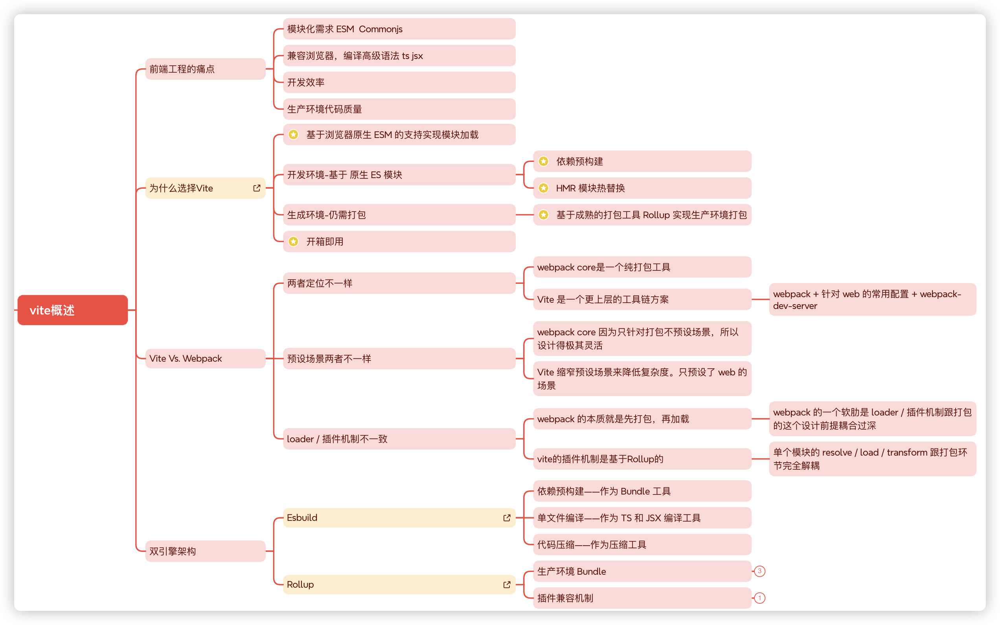

# Vite相关性能优化

# 技术讲解

## 什么问题

**性能优化基本是简历中必定会出现的内容**，这本身算简历中的一个亮点难点，但是问题是基本会写简历的人都会写这个内容，所以，想更加的优秀，那么我们还需要**在亮点中再高亮**，所以一定要表达出下面几点：

1、对Vite整体的认知程度

2、为什么要性能优化，优化的指标是什么？

3、怎么进行性能优化

4、优化的结果是什么？

5、能突出表达你在性能优化中的**高亮点**

Vite 在开发环境性能已经非常不错了，因为Vite在开发环境使用了esbuild进行了依赖预构建。一般情况下很舒服，但是也会有一些坑点。

生产环境应该如何优化呢？ Vite 打包时用的是 Rollup，但是基本的优化处理，其实和 Webpack 差不多，但是无论如何优化问题我们还是要进行处理的。

## 解决思路

**开发环境**的依赖预构建没什么可多说的，但是会存在一个问题，如果我们使用了按需引入的插件，类似于[element-plus](https://element-plus.org/zh-CN/guide/quickstart.html#%E6%8C%89%E9%9C%80%E5%AF%BC%E5%85%A5)这一种，特别是存在切换路由的情况的时候，可能会导致一种情况，我们需要连续点两次，才会生效，而且界面还可能存在闪动的情况。仔细查看会发现点击路由的时候，Vite还进行了依赖预构建的处理：

```js
[vite] ✨ new dependencies optimized: ......
[vite] ✨ optimized dependencies changed. reloading
```

为了防止在启动时占用大量编译时间，vite只会处理一些常用的组件和依赖，特别是在按需加载的时候，加上vite本身就会忽略`node_modules`中的内容，这就导致一些按需的依赖会在开发进入到对应页面时才会处理，从而导致一直在处理依赖优化和reloading。

通过分析，类似于`element-plus`，`vant`等等这种可以按需加载的组件，Vite的优化触发是在style样式加载，那么我们就让他开发模式把所有组件的样式全优化了

```json
optimizeDeps: {
  include: [
    "element-plus/es/components/**/style/css",
  ]
},
```

**生产环境**的优化，大部分都是和打包优化相关的

- 分包策略
- 构建分析
- 摇树优化
- 代码压缩
- GZIP压缩
- 图片压缩
- CDN加速

这些基本都是常用的手段，就不在一一描述了，只不过在一些优化上，我们可能需要vite插件配合，甚至需要自定义插件

## 解决细节

### 1、Vite的基本认知



### 2、量化指标

#### 使用量化指标的原因

**性能优化并不是一句口号，所以要优化，首先就需要确立指标**。

领导突然来一句，项目需要优化，是的，你知道优化，也有念头从你脑子里蹦出来，但是从何入手？，如何制定计划？**没有量化指标，就没有指导方向，也不会有我们优化之后的基线和目标**

量化指标大家嘴上都在说，比如FCP，LCP，TTI，CLS，FID，TBT等等

#### FCP (First Contentful Paint)

首次内容绘制，浏览器首次绘制来自`DOM`的内容的时间，内容必须包括文本，图片，非白色的`canvas`或`svg`，也包括带有正在加载中的`web`字体文本。这是用户第一次看到的内容。

| FCP时间(秒) | 颜色编码   | FPC分数  |
| ----------- | ---------- | -------- |
| 0 - 1.8     | 绿色(快)   | 75 - 100 |
| 1.8 - 3     | 橙色(中等) | 50 - 74  |
| 超过3       | 红色(慢)   | 0 - 49   |

#### LCP (Largest Contentful Paint)

最大内容绘制，可视区域中最大的内容元素呈现到屏幕上的时间，用以估算页面的主要内容对用户的可见时间。`img`图片，`video`元素的封面，通过`url`加载到的北京，文本节点等，为了提供更好的用户体验，网站应该在`2.5s`以内或者更短的时间最大内容绘制。

| LCP时间(秒) | 颜色编码   |
| ----------- | ---------- |
| 0 - 2.5     | 绿色(快)   |
| 2.5 - 4     | 橙色(中等) |
| 超过4       | 红色(慢)   |

#### FID (First Input Delay)

首次输入延迟，从用户第一次与页面进行交互到浏览器实际能够响应该交互的时间，输入延迟是因为浏览器的主线程正忙于做其他事情，所以不能响应用户，发生这种情况的一个常见原因是浏览器正忙于解析和执行应用程序加载的大量计算的`JavaScript`。

| FID时间(毫秒) | 颜色编码   |
| ------------- | ---------- |
| 0 - 100       | 绿色(快)   |
| 100 - 300     | 橙色(中等) |
| 超过300       | 红色(慢)   |

#### TTI (Time to Interactive)

网页第一次完全达到可交互状态的时间点，浏览器已经可以持续的响应用户的输入，完全达到可交互的状态的时间是在最后一个长任务完成的时间，并且在随后的`5s`内网络和主线程是空闲的。从定义上来看，中文名称叫持续可交互时间或可流畅交互时间更合适。

| TTI时间(秒) | 颜色编码   |
| ----------- | ---------- |
| 0 - 3.8     | 绿色(快)   |
| 3.9 - 7.3   | 橙色(中等) |
| 超过7.3     | 红色(慢)   |

#### TBT (Total Block Time)

总阻塞时间，度量了`FCP`和`TTI`之间的总时间，在该时间范围内，主线程被阻塞足够长的时间以防止输入响应。只要存在长任务，该主线程就会被视为阻塞，该任务在主线程上运行超过`50`毫秒。

线程阻塞是因为浏览器无法中断正在进行的任务，因此如果用户确实在较长的任务中间与页面进行交互，则浏览器必须等待任务完成才能响应。

| TBT时间(毫秒) | 颜色编码   |
| ------------- | ---------- |
| 0 - 300       | 绿色(快)   |
| 300 - 600     | 橙色(中等) |
| 超过600       | 红色(慢)   |

#### CLS (Cumulative Layout Shift)

累计布局位移，`CLS`会测量在页面整个生命周期中发生的每个意外的布局移位的所有单独布局移位分数的总和，他是一种保证页面的视觉稳定性从而提升用户体验的指标方案。

用人话来说就是当点击页面中的某个元素的时候，突然布局变了，手指点到了其它位置。比如想点击页面的链接，突然出现了一个`banner`。这种情况可能是因为尺寸未知的图像或者视频。

| CLS时间(毫秒) | 颜色编码   |
| ------------- | ---------- |
| 0 - 0.1       | 绿色(快)   |
| 0.1 - 0.25    | 橙色(中等) |
| 超过0.25      | 红色(慢)   |

#### 性能测试

指标有了，怎么样进行测试？自行测试可以使用浏览器工具，比如`Chrome DevTools`，Lighthouse，Performance，Network网络分析，Memory 面板等等，这些数据拿到的结果都是实验室数据。

要准确的用户数据就必须上相关的性能监控埋点。

但是说这些指标，这些工具手段的前提是，你要知道为什么？

### 3、具体方案

#### 1、分包策略

在生产环境下 Vite 完全利用 Rollup 进行构建，因此拆包也是基于 Rollup 来完成的

##### Vite 默认拆包策略

只不过Rollup专注于JS库的打包，对应用构建的能力还有待提升，Vite 正好是补足了 Rollup 应用构建的能力，在拆包能力这一块的扩展就是很好的体现

**项目的基本结构：**

```javascript
.
├── public
│   ├── vite.svg
├── src
│   ├── routes
│   │			└── index.ts				//路由配置
│   ├── views
│   │			├── AboutView.vue 	// 懒加载路由页面
│   │			├── HomeView.vue		// 直接加载路由页面
│   │			├── PhotoView.vue   // 懒加载路由页面
│   │			├── StudentView.vue // 懒加载路由页面
│   │			└── UserView.vue		// 懒加载路由页面
│   ├── App.vue
│   └── main.ts
└── index.html                
```

**执行打包:**

```javascript
vite v4.4.9 building for production...
✓ 34 modules transformed.
dist/index.html                        0.45 kB │ gzip:  0.29 kB
dist/assets/AboutView-786d9592.css     0.04 kB │ gzip:  0.06 kB
dist/assets/index-d1e7a483.css         0.27 kB │ gzip:  0.17 kB
dist/assets/UserView-18eefd25.js       0.54 kB │ gzip:  0.35 kB
dist/assets/StudentView-85c73246.js    0.55 kB │ gzip:  0.35 kB
dist/assets/AboutView-355cc1df.js      0.74 kB │ gzip:  0.42 kB
dist/assets/index-c0c63fdb.js        216.25 kB │ gzip: 51.48 kB
✓ built in 552ms
```

**打包之后的产物：**

```javascript
.
├── assets
│   ├── AboutView-355cc1df.js   // Async Chunk
│   ├── AboutView-786d9592.css 	// Async Chunk (CSS)
│   ├── index-c0c63fdb.js      	// Initial Chunk
│   ├── index-d1e7a483.css     	// Initial Chunk (CSS)
│   ├── StudentView-85c73246.js // Async Chunk
│   └── UserView-18eefd25.js		// Async Chunk
├── index.html                 	// 入口 HTML
└── vite.svg										// 静态资源
```

这是没有任何配置的vite打包之后的产物，**自动对懒加载的路由和与其对应的css进行的处理**

##### 自定义拆包策略

针对更细粒度的拆包，`Vite`还是基于的`Rollup`处理。

`manualChunks` 主要有两种配置的形式，可以配置为一个对象或者一个函数。

###### 对象方式

```typescript
build: {
  ...
  rollupOptions: {
    output: {
      ...
      manualChunks:{
        'vue-vendor': ['vue', 'vue-router']
      }
    }
	}
}
```

在对象格式的配置中，`key`代表 chunk 的名称，`value`为一个字符串数组，每一项为第三方包的包名

```javascript
vite v4.4.9 building for production...
✓ 34 modules transformed.
dist/index.html                        0.54 kB │ gzip:  0.33 kB
dist/assets/AboutView-786d9592.css     0.04 kB │ gzip:  0.06 kB
dist/assets/index-d1e7a483.css         0.27 kB │ gzip:  0.17 kB
dist/assets/UserView-9010cdee.js       0.55 kB │ gzip:  0.35 kB
dist/assets/StudentView-eff7d69a.js    0.55 kB │ gzip:  0.35 kB
dist/assets/AboutView-74a57329.js      0.78 kB │ gzip:  0.43 kB
dist/assets/index-4fb9786f.js          5.87 kB │ gzip:  2.06 kB
dist/assets/vue-vendor-99c39a4b.js   210.95 kB │ gzip: 49.67 kB
✓ built in 553ms
```

可以看到之前很大的`index.js`文件被拆分了出来。

###### 函数方式

```typescript
manualChunks(id) {
  if (id.includes('node_modules/vue')) {
    return 'vue';
  }
  if (id.includes('element-plus')) {
    return 'element-plus';
  }
  if (id.includes('lodash-es')) {
    return 'lodash';
  }
}
```

不过需要注意的是，这种方式在Vite4并不安全，因为`element-plus`这种库也依赖了`Vue`，这里单独拆分`Vue`的话，导致**循环依赖的错误问题**。**建议还是使用对象方式**

#### 2、treeshaking

这个没什么可多说的，不需要额外进行配置。但有一个条件，必须是 `ES6 module` 模块才行，而且我们自己在引入的时候，注意**只需要引入具体的函数(对象),不要直接导入全对象**

#### 3、代码压缩

`Vite`默认使用`esbuild`进行代码压缩，速度快，如果要追求压缩效果。

```typescript
minify:esbuild
```

也可以使用`terser`，`Vite`也默认集成了`terser`，只是需要手动导入`terser`插件

```typescript
minify: 'terser',
terserOptions: {
  compress: {
      drop_console: true,
      drop_debugger: true,
  }
},
```

#### 4、GZIP压缩

`gzip` 是一种使用非常普遍的压缩格式。使用 `gzip` 压缩可以大幅减小代码体积，提升网络性能。当然`gzip`只是其中一种，`brotliCompress`也是一样，一般简称`br`

服务器就可以直接帮我们处理，不过需要耗费服务器性能，所以，一般前端也可能直接把打包之后的文件进行压缩处理，直接使用插件即可[vite-plugin-compression2](https://github.com/nonzzz/vite-plugin-compression)，

```typescript
import { compression } from 'vite-plugin-compression2'
......

plugins: [
  ......
  compression({
    //压缩算法，默认gzip
    algorithm: 'brotliCompress',
    //匹配文件
    include: [/\.(js)$/, /\.(css)$/,],
    //压缩超过此大小的文件,以字节为单位
    // threshold: 10240,
    //是否删除源文件，只保留压缩文件
    // deleteOriginalAssets: true
  }),
  ]
```

#### 5、图片压缩

图片压缩肯定可以减少网络传输，不过需要看项目对图片清晰度的需求，一般情况下，如果美工能直接处理最好，或者我们也可以使用外部工具进行处理，甚至是网上就可以直接处理，比如：[tinypng](https://tinypng.com/)

如果前端处理的话，可以使用插件[vite-plugin-imagemin](https://github.com/vbenjs/vite-plugin-imagemin)

```typescript
import viteImagemin from 'vite-plugin-imagemin'
......
plugins: [
  ...... 
  viteImagemin({
     gifsicle: {
       optimizationLevel: 7,
       interlaced: false,
     },
     optipng: {
       optimizationLevel: 7,
     },
     mozjpeg: {
       quality: 20,
     },
     pngquant: {
       quality: [0.8, 0.9],
       speed: 4,
     },
     svgo: {
       plugins: [
         {
           name: 'removeViewBox',
         },
         {
           name: 'removeEmptyAttrs',
           active: false,
         },
       ],
     },
   }),
]
```

#### 6、产物构建分析

为了能可视化地感知到产物的体积情况，推荐大家用[rollup-plugin-visualizer](https://github.com/btd/rollup-plugin-visualizer)来进行产物分析

```typescript
import { visualizer } from "rollup-plugin-visualizer";
......
plugins: [
  visualizer({
    // 是否打包完成之后直接打开
    open: true,
  }),
],
```

#### 7、CDN加速

使用CDN，可以让用户从最近的服务器请求资源，能够大大的提高资源的请求获取的速度。特别是一些第三方资源库，放在CDN上不但可以提高资源请求速度，而且也能大大降低我们打包体积和打包速度。

如果要把项目中的一些第三方资源放入到CDN，但是项目中我们又使用了这些资源，需要在项目中进行处理。一般比较常用的处理方式是直接使用第三方插件。比如：[rollup-plugin-external-globals](https://github.com/eight04/rollup-plugin-external-globals)

```typescript
import externalGlobals from "rollup-plugin-external-globals";
......
rollupOptions: {
  external:['vue','vue-router','element-plus','vue-echarts','echarts','@vueuse/core'],
  plugins: [
    externalGlobals({
      "vue": "Vue",
      "vue-router": "VueRouter",
      "element-plus": 'ElementPlus',
      "@vueuse/core": "VueUse",
      "echarts": "echarts",
      "vue-echarts": "VueECharts",
    })
  ],
}
```

#### 8、打包处理

如果希望设置打包之后的文件位置，可以通过相关rollup设置处理

```typescript
build:{
  rollupOptions: {
    output: {
      chunkFileNames: 'assets/[name]-[hash].js',
      entryFileNames: 'assets/[name].[hash].js',
      assetFileNames: 'assets/xxx/[ext]/[name]-[hash].[ext]',
    }
}
```

#### 9、自定义插件

Vite 插件扩展了设计出色的 Rollup 接口，整个Rollup插件结构体系比较庞杂，简单来说，分成了`build`和`output`两大工作流的不同阶段进行分类。这个还需要单独去学习。就Vite来说他有可以和rollup结合的[通用钩子](https://cn.vitejs.dev/guide/api-plugin#universal-hooks)，也有自己的[独有钩子](https://cn.vitejs.dev/guide/api-plugin#vite-specific-hooks)

**Vite独有钩子：**

| **钩子名称**           | **释义**                                                     |
| ---------------------- | ------------------------------------------------------------ |
| config                 | 在解析 Vite 配置前调用。钩子接收原始用户配置（命令行选项指定的会与配置文件合并）和一个描述配置环境的变量，包含正在使用的 mode 和 command。 |
| configResolved         | 在解析 Vite 配置后调用。使用这个钩子读取和存储最终解析的配置。 |
| configureServer        | 是用于配置开发服务器的钩子。                                 |
| configurePreviewServer | 与 [configureServer](https://link.juejin.cn?target=https%3A%2F%2Fvitejs.cn%2Fvite3-cn%2Fguide%2Fapi-plugin.html%23configureserver) 相同但是作为预览服务器。 |
| transformIndexHtml     | 转换 index.html 的专用钩子。钩子接收当前的 HTML 字符串和转换上下文。 |
| handleHotUpdate        | 执行自定义 HMR 更新处理。                                    |

