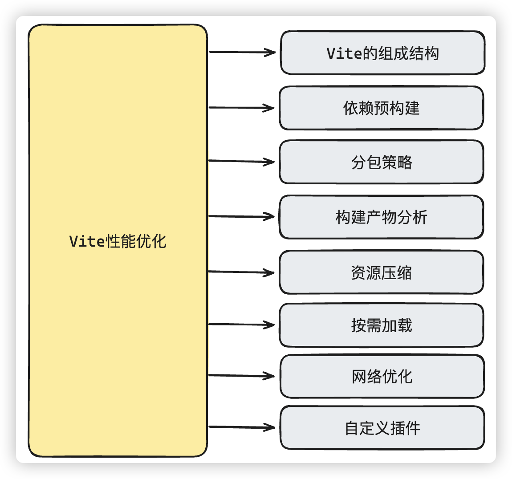

# Vite相关性能优化

# 面试讲解

## 知识点图谱



## 难点描述

**模拟问题：**我看你有一个项目亮点，对Vite做了相关的性能优化，你做了哪些处理呢？

>**问题分析：**
>
>性能优化本身其实算作比较八股的一个问题，既然把这个内容写出来，并且面试官问出来，那么回答的就需要**有理有据，根据实际的项目分析**。回答的流程还是需要有条理性
>
>为什么需要做优化
>
>怎么分析并处理优化
>
>最终确定方案和优化结果
>
>**突显出我们对性能优化独特的见解和一些工程化手段**
>
>**参考答案：**
>
>其实Vite宣称自己下一代的前端工具链，本身在一些优化处理上已经比较出色了，特别是**开发阶段**，**依靠esbuild处理的依赖预构建**，让我们的开发体验已经很舒服了，不过在**开发过程中我发现还是有一些小问题**，如果开发过程中我们有动态的依赖导入，特别是在**和路由懒加载结合使用的时候**，第一次运行会导致**依赖预构建重新进行加载**，从而导致可能路由跳转不成功，或者页面出现闪烁。
>
>通过分析最后发现是类似于`element-plus`，`vant`等等这种可以按需加载的组件，Vite的优化触发是在style样式加载，那么我们就让他开发模式把所有组件的样式全优化了，也就是说把样式直接先进入到依赖预构建中
>
>另外的优化点当然就是在**打包阶段**了。
>
>**不过优化并不是空喊口号，要优化，首先就需要确立量化指标，没有量化指标，就没有指导方向，也不会有我们优化之后的基线和目标**
>
>所以在打包生产阶段的优化，我们需要根据实际情况来进行分析。
>
>不过一般来说，对于Vite打包阶段的优化，**其中最重要的一点，就是资源的压缩**，因为只有资源压缩减少了，我们打包的体积才会减少，用户请求资源的时间才会减少。所以对于**资源的压缩一般都是比较常规的代码压缩，gzip压缩，图片压缩**等等。
>
>当然Vite本身是基于ESM，所以代码阶段我们也需要注意使用ESM方式按需加载。更加有利于摇树优化
>
>另外一个点，就是**分包策略**了，分包策略当然**最重要的是为了更好的利用浏览器缓存**
>
>**但是为了平衡浏览器缓存的利用率，首页文件加载过大，以及顾及SEO的情况(埋钩子：引起面试官继续提问，如果面试官不追问，我们自己也需要引出来说，这一块有很多可以聊的内容)**，我采用的策略是：**将node_modules中第三方lib打包到一个vendor里面，过大的第三方包独立分包，业务代码维持单chunk，通过HTTP2保证页面加载速度**。
>
>就仅仅分包处理这一块，我们使用Vite的构建时间减少了10s-15s，首次需要加载的文件体积更是缩小了近1mb，更重要的是开启了HTTP2，后续代码更新的时候，可以最大程度地复用缓存，加载速度可以进一步提升
>
>当然还需要代码层面做一些优化处理，一般的最低要求是如果可以做按需加载的代码或者第三方库，毕竟**Vite我们要利用好摇树优化的特点**。
>
>另外网络的优化其实对项目整体的性能提升也很明显，比如上面提到的开启HTTP2，可以明显的提升传统的 `HTTP 1.1` 存在**队头阻塞(埋钩子)**的问题，我们还可以开启**DNS预解析**，提前缓存IP地址。改善用户第一次访问的体验。
>
>对于一些比较重要的资源，我们可以通过 `Preload` 方式进行预加载（在资源使用之前就进行加载，而不是在用到的时候才进行加载，这样可以使资源更早地到达浏览器）。`Prefetch` 也是一个比较常用的优化方式，它相当于告诉浏览器空闲的时候去预加载其它页面的资源，但是，**Vite默认并没有提供`Prefetch` 的功能**，默认只有`Preload` ，所以我**自定义了Vite插件**，通过Vite插件的钩子`transformIndexHtml`，给链接加上Prefetch，从而达到`Prefetch预加载`的效果**（埋钩子：展示自己在这一块的亮点）**
>
>**通过上面的一些优化**，开发阶段显得更加的顺畅，打包体积明显减小，而且打包时间减少了将近20s左右，当然主要还是用户侧的感受更加流程了，首页的FCP从原来的2.3s，变成了优化之后的0.7s，LCP也是从原来的3.4s左右，减低到了优化过后比较稳定的1.8s左右，TBT总阻塞时间也控制在300毫秒以内
>
>(**追问**，面试官你看还有哪些细节我需要重点说一下)

## 知识点叙述

### 1、依赖预构建

**模拟问题：**我刚刚听你说到了依赖预构建，你能说一下他的原理吗？Vite为什么要用依赖预构建？

> **问题分析：**
>
> 基础问题，面试官是想考察你对vite的了解程序，这种问题需要从vite的整个理念构成解释清楚，不然就很容易像在背书，而且结合着我们上面讲解的问题一起说明，更具有说服力
>
> **参考答案：**
>
> 因为Vite所提倡的模块化是ESM，但是如果我们在开发的时候，不加以控制的话，其实会导致两个问题，一个是**第三方包的模块化规则我们并不能控制**，另外一个，对于有一些同ESM处理的第三方依赖，可能会导致**请求瀑布流的问题（loadsh）**。所以基于这两个ESM模块化的缺陷，Vite通过esbuild在开发阶段进行的依赖预构建的处理，简单来说就是我们运行之前，先通过esbuild对第三方依赖进行打包处理。esbuild是通过go语言开发的，所以完全不需要纠结他的效率问题。而且每一次的依赖预构建的打包都是增量的，而不是全量的，这样的速度非常快，从而也导致Vite在开发阶段的使用非常的舒服。
>
> 而且**依赖预构建**不仅仅就是只是处理预先打包，还会对我们代码中的`import`的引入地址进行重写，开发阶段都会指向到`node_modules/.vite/deps`目录下。并且在开发环境下，还能进行自动依赖搜索，会优先查找预构建缓存，如果没有找到，还会自动的引入依赖项，并将新的内容加入进去，然后重启开发服务器。
>
> 这是种做法对于我们开发者来说相当的舒服，无论在启动还是运行阶段都非常的快速。
>
> 当然，如果你不是太了解这个机制的话，有时候可能会造成心智负担，比如，我们上面提到的动态导入的UI库，像`element-plus`，`vant`这些，由于styles样式都是存在于`node_modules`中的。所以在动态导入的情况下，vite的依赖预构建重新加载了新的内容到缓存，这导致了服务器的重新刷新，而vite的开发服务器又有**HMR(模块热替换)**，这就导致了如果在切换路由的时候做了这个时候，就好像没有效果一样。而且只有第一次是这样，因为新的内容已经加入到预构建中了，下一次就不会复现这个情况了。
>
> 需要把`node_modules`中的`.vite`删除，下一次才会复现这个问题，当然解决的办法很简单，直接在配置中将**ui库的styles样式直接加入进预构建**就行了。这样处理之后让我们的开发体验就更舒服了。

### 2、分包策略

**模拟问题：**我看你专门提到了分包策略，你为什么要选择这样一种的分包策略呢？

> **问题分析：**
>
> 这个问题由我们上面埋下的钩子引出的，我们需要解释为什么会采用这样的分包策略，展示我们的思考，以及对技术的追求，也能引出面试官更多的追问。
>
> **参考答案：**
>
> 其实Vite有默认的分包策略，默认的只是会区分`Initial Chunk`和`Async Chunk`。但是现实情况下，这显然并不够。因为我们的项目中引入了很多的第三方依赖，当然还有我们自己的代码。把所有第三方包和我们自己的业务代码全部打入到`Initial Chunk`中，后续的**浏览器缓存的利用率**太低了。(**注意：这里面试官可能会问到浏览器缓存相关问题，无非也就是强缓存和协商缓存，如果不是太清楚的同学自行补充相关知识点**)因此需要把**第三方依赖和业务代码分开**，提高缓存的命中率
>
> 有一些比较大的第三方依赖，需要使用按需加载。当然第三方依赖我还是稍微做了处理，有些比较稍微大一些的第三方依赖单独进行了打包，防止第三方包体积太大，并且也有利于替换有些需要升级的第三方包。
>
> 为了防止`HTTP 1.1` 存在**队头阻塞**的问题，所以我们开启了`HTTP2`，通过多路复用的特性，来避免每个资源都占用一个TCP链接，导致浏览器的最大并发请求限制的问题。这样的话，就算我们有很多链接都不会存在太大问题。
>
> 不过要注意的是，在rollup的在[issue](https://github.com/rollup/rollup/issues/4327)这个文档中提到，由于chunk数量太多，会导致Google收录站点存在问题(**表现自己追求技术**)。也就是会影响SEO的表现，虽然我们的项目目前并没有过多考虑SEO，但还是可以尝试控制一下chunk数量。所以最后我使用**分包策略比较的收敛**：
>
> - node_modules中的第三方依赖，统一合并到vendor文件，少数需要按需加载的包或者较大的第三方包，单独构建chunk
> - 业务代码，单独构建chunk，配合CDN开启HTTP2的方式，保证页面加载速度
>
> 这样既利用了浏览器缓存，也利用了网络优势，而且在**异步chunk的处理上，我还专门的使用自定义的插件来进行处理**
>
> 最后这样分包之后，无论是打包体积，还是首页渲染上，都有比较好的表现，

### 3、Vite插件

**模拟问题：**你刚刚提到的自定义插件解决异步chunk( `async chunk`)是什么意思？

> **问题分析：**
>
> 给面试官留下的钩子，引导面试官追问，体现自己对Vite体系的熟悉和对技术的热爱追求
>
> **参考答案：**
>
> 我们知道link标签可以通过`preload`和`preftch`，这两个其实都表示预加载，不过区别是：
>
> `preload`会告诉浏览器立即加载资源，`prefetch` 告诉浏览器在空闲时才开始加载资源；
>
> 不过在`Vite`中默认使用的属性是`modulepreload`，这个属性对于模块化支持更好，因为可以模块依赖处理，自动引用关联的js。不过`modulepreload`的兼容性并不好，而且仅仅只能服务于js文件。而且对于路由懒加载模块，我期望的是在浏览器空闲时间，帮我下载路由懒加载的模块，也就是可以使用`prefetch`属性，经过反复测试，返现Vite并不支持。因此，我就在vite插件的钩子`transformIndexHtml`的时候，获取`bundle`链接，将`bundle`链接都加上prefetch属性，再放入到html页面中。(**注意：可能会被追问vite的插件机制，这是一大块内容，因为还包括rollup的插件机制**)
>
> ```typescript
> // prefetchPlugin.ts
> import { ResolvedConfig, ViteDevServer, type Plugin } from 'vite';
> 
> // prefetch插件选项的接口定义
> export interface IPrefetchPluginOption {
>   excludeFn?: (assetName: string) => boolean; // 排除函数，接受资源名称并返回布尔值
> }
> 
> // prefetch插件的实现
> const prefetchPlugin: (option?: IPrefetchPluginOption) => Plugin = (option) => {
>   let config: ResolvedConfig; // 存储解析后的配置
>   return {
>     name: 'vite-plugin-bundle-prefetch', // 插件名称
>     apply: 'build', // 只在构建阶段应用
>     configResolved(resolvedConfig: ResolvedConfig) {
>       config = resolvedConfig;
>     },
>     transformIndexHtml(
>       html: string,
>       ctx: {
>         path: string;
>         filename: string;
>         server?: ViteDevServer;
>         bundle?: import('rollup').OutputBundle;
>         chunk?: import('rollup').OutputChunk;
>       }
>     ) {
>       const bundles = Object.keys(ctx.bundle ?? {}); // 获取所有打包文件的名称
>       const isLegacy = bundles.some((bundle) => bundle.includes('legacy')); // 判断是否为老旧浏览器构建
>       if (isLegacy) {
>         // 如果是老旧浏览器构建，则不添加prefetch
>         return html;
>       }
>       // 移除.map文件
>       let modernBundles = bundles.filter(
>         (bundle) => bundle.endsWith('.map') === false
>       );
>       const excludeFn = option?.excludeFn;
>       if (excludeFn) {
>         // 如果存在排除函数，则过滤掉需要排除的文件
>         modernBundles = modernBundles.filter((bundle) => !excludeFn(bundle));
>       }
>       // 移除已经存在的文件并将它们拼接成link标签
>       const prefechBundlesString = modernBundles
>         .filter((bundle) => html.includes(bundle) === false)
>         .map((bundle) => `<link rel="prefetch" href="${config.base}${bundle}">`)
>         .join('');
> 
>       // 使用正则表达式获取<head> </head>内的内容
>       const headContent = html.match(/<head>([\s\S]*)<\/head>/)?.[1] ?? '';
>       // 将prefetch内容插入到head中
>       const newHeadContent = `${headContent}${prefechBundlesString}`;
>       // 替换原始的head
>       html = html.replace(
>         /<head>([\s\S]*)<\/head>/,
>         `<head>${newHeadContent}</head>`
>       );
> 
>       return html;
>     },
>   };
> };
> 
> export default prefetchPlugin; 
> 
> ```
>
> 使用：
>
> ```typescript
> import prefetchPlugin from './prefetchPlugin.js';
> 
> ......
> export default {
>   plugins: [prefetchPlugin()],
> };
> ```

### 4、vite 的配置解析的流程

**模拟问题：**我看你对Vite的插件挺熟悉的，你能说说vite插件是怎么处理的吗？

> **问题分析：**
>
> 由于我们前面铺垫了插件相关的知识，这里肯定会问到，当然vite插件相关的内容是比较庞杂的，而且还兼容rollup的插件，面试时说这些，容易理不清头绪，很乱，关键是说多了，也没有意义。不过vite的整个配置流程，差不多就是插件的执行流程，所以我们借助面试官问插件相关内容，顺便回答vite build相关执行流程会更好。
>
> **参考答案：**
>
> Vite 插件主要是扩展了设计出色的 Rollup 接口，**整个Rullup的插件体系主要就是两大工作流，build阶段和ouput阶段**，基本上整个rollup的运行流程，就是两大插件工作流的运行流程。Vite的插件有和rollup通用的钩子，也有自己独有的钩子来服务于特定的 Vite 目标。比如我们上面用到的`configResolved`，`transformIndexHtml`就是两个Vite独有的钩子。
>
> 其实，Vite build 的代码量其实非常的少，因为在 build 阶段，Vite 是利用 Rollup 去完成构建，整个过程只需要调用 Rollup 提供的 JS API 即可，整个过程中，Vite 的工作只是在做**配置的转换**，把 Vite 的配置转换成 Rollup 的 input 和 output 配置。
>
> 而Vite的插件其实就是在整个流程的不同阶段，可以去处理不同的事情，所以我们在开发插件的时候只需要想清楚，我们要处理什么样的事情，要在什么时机去做就可以了。
