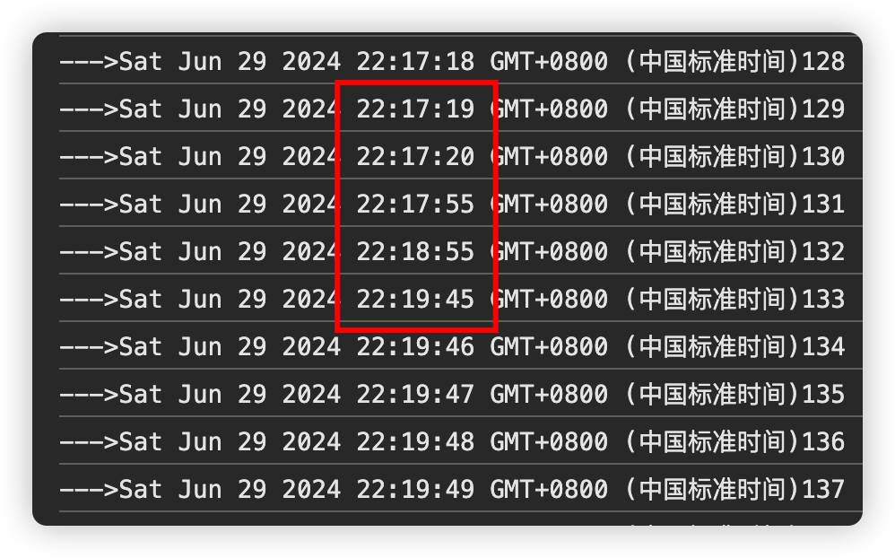
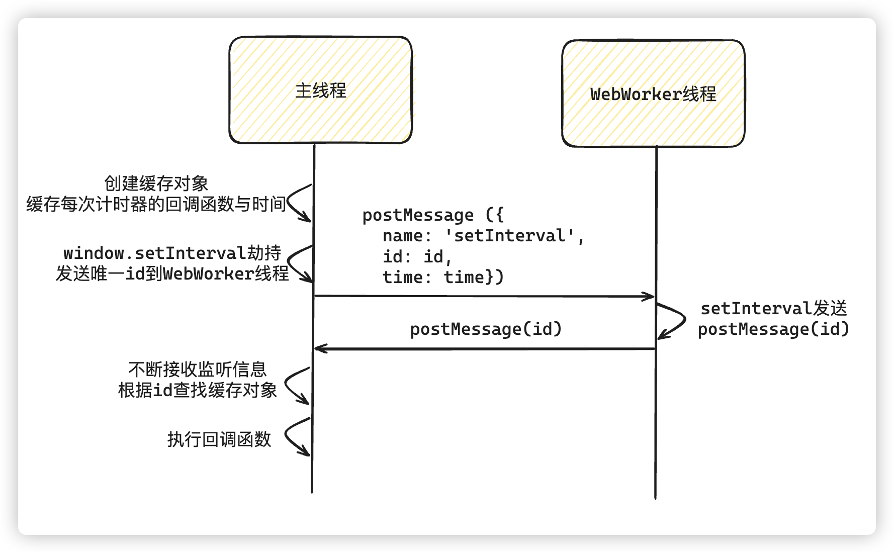

# 计时器节流问题

# 技术讲解

## 什么问题

有时候会有这样的需求，比如，在一些有编辑需求的应用中，如果长时间不对页面进行编辑，就自动帮你退出编辑状态。

咋一看感觉挺简单，用setinterval不就行了？但是还有要求是，**必须保证在当前页面失活的时候，定时器是正常的**。

这样的需求有什么问题？

## 解决思路

首先要知道，直接使用计时器会有什么问题？这是因为浏览器认为`setTimeout()` / `setInterval()`如果当前页面失活了，继续按照之前的方案去执行，可能会消耗大量资源。在后台选项卡中以极短间隔运行回调的应用程序可能会消耗大量内存，以至于当前活动选项卡的运行可能会受到影响。在最坏的情况下，浏览器可能会崩溃，或者设备的电池会迅速耗尽。

在这种情况下，对后台选项卡中运行的计时器施加一些限制是有意义的。

所以，对于有些浏览器来说，比如[Chrome](https://developer.chrome.com/blog/background_tabs?hl=zh-cn)，**对于非活动选项卡，它们会自动限制计时器每 1 秒运行一次，而不管代码中指定的原始延迟是多少**。例如，如果代码**最初使用setInterval()每 50 毫秒**运行一次某些代码，一旦应用程序移至后台选项卡，间隔就会自动变为 **1000 毫秒（1 秒），随着时间的推移，时间差距也会慢慢拉大。** 然而，一旦重新激活选项卡，原始间隔或延迟就会返回到原始值。

下面是一个简单的`setInterval`计时，一秒打印一次，切换页签一段时间之后，可以很明显的看出时间间隔甚至出现了一分钟一次

```js
let sum = 0;
setInterval(() => {
  sum += 1;
  console.log("--->" + new Date() + sum);
}, 1000);
```



如果我们只是想在页面失活的时候暂停计时器，那比较简单，我们可以使用 `Page Visibility API` 来查找用户是否离开了标签页，或者是否再次返回了标签页

```js
document.addEventListener('visibilitychange', function() {
    if(document.hidden) { // 或者document.visibilityState === 'hidden'
        // 当前标签页失活了
    }
    else { // 或者document.visibilityState === 'visible'
        // 当前标签页激活了
    }
});
```

但是，我们的要求是，如果当前页签失活了，还是希望失活的页面继续精确的计时，而不是简单的暂停了事。

思考了一下觉得可以在切换页面的时候新建一个**线程来准确的计时**。

要在页面使用线程，那就只有用 **web worker** 了，用它单纯来进行计时，不用管其他逻辑，切换页面也不会有误差或者终止。

## 解决细节

1、 [Web Worker](https://developer.mozilla.org/zh-CN/docs/Web/API/Web_Workers_API) 

`Web Worker` 是 HTML5 标准的一部分，这一规范定义了一套 API，允许我们在 js 主线程之外开辟新的 Worker 线程，并将一段 js 脚本运行其中，它赋予了开发者利用 js 操作多线程的能力。

因为是独立的线程，Worker 线程与 js 主线程能够同时运行，互不阻塞。所以，在我们有大量运算任务时，可以把运算任务交给 Worker 线程去处理，当 Worker 线程计算完成，再把结果返回给 js 主线程。这样，js 主线程只用专注处理业务逻辑，不用耗费过多时间去处理大量复杂计算，从而减少了阻塞时间，也提高了运行效率，页面流畅度和用户体验自然而然也提高了。

虽然 Worker 线程是在浏览器环境中被唤起，但是它与当前页面窗口运行在不同的全局上下文中，我们常用的顶层对象 `window`，以及 `parent` 对象在 Worker 线程上下文中是不可用的。另外，在 Worker 线程上下文中，操作 DOM 的行为也是不可行的，`document`对象也不存在。但是，`location`和`navigator`对象可以以可读方式访问

**基本使用：**

**main.js（主线程）**

```js
const myWorker = new Worker('/worker.js'); // 创建worker

myWorker.addEventListener('message', e => { // 接收消息
    console.log(e.data); // Hello from Worker.js，worker线程发送的消息
});

// 这种写法也可以
// myWorker.onmessage = e => { // 接收消息
//    console.log(e.data);
// };

myWorker.postMessage('Hello from Main.js'); // 向 worker 线程发送消息，对应 worker 线程中的 e.data
```

**worker.js（worker线程）**

```js
self.addEventListener('message', e => { // 接收到消息
    console.log(e.data); // Hello from Main.js，接收主线程发送的消息
    self.postMessage('Hello from Worker.js'); // 向主线程发送消息
});
```

**WebWork子线程处理计时器**

**App.vue（主线程）**

```js
<template>
  <div id="app">
    <h1>这是编辑页面</h1>
  </div>
</template>

<script>
export default {
  name: "App",
  data() {
    return {
      sum: 0
    };
  },
  mounted() {
    this.myWorker = new Worker("/worker.js");
    this.myWorker.postMessage("start");
    this.myWorker.addEventListener("message", (e) => {
      console.log(e.data);
      this.sum = e.data.sum;
      if (this.sum >= 10) { // 10秒后失效
        console.log("页面失效");
        this.myWorker.postMessage("end");
      }
    });
  },
};
</script>
```

**WebWork（子线程）**

```js
let timer;
self.addEventListener("message", (e) => {
  // 接收到消息
  console.log(e.data); // 主线程发送的消息
  let sum = 0;
  let msg;

  if (e.data === "start") {
    console.log("--->重新开始计时");
    timer = setInterval(() => { // WebWork子线程计时
      sum += 1;
      msg = {
        text: "编辑中",
        sum,
      };
      self.postMessage(msg); // 向主线程发送消息 msg 对象
    }, 1000);
  } else {
    console.log("===>关闭计时");
    clearInterval(timer);
  }
});
```


2、心跳检测

在编辑页面，为了保证不出现多人同时编辑的状态，同一时间只能有一个人编辑，和后端配合，每分钟向后端发送简单的通讯包(当然由谁主动发送都可以，可以是客户端，也可以是服务器端，客户端主动发送稍微简单一些)，后端就会帮你保持正在编辑的状态，这种对时间精准性要求不是那么严格，收到一个心跳后，可以简单设置连接标志，比如`{edit:true}`，如果别人想要编辑，就会拒绝别人的编辑。如果你一分钟后没发送这个心态检测，后端会把 `true` 改成 `false`，这时别人想要编辑，后端就会接受别人的编辑了

3、切换标签页

```js
document.addEventListener("visibilitychange", function () {
  if (document.visibilityState == "visible") {
    console.log("visible")
  } else if  (document.visibilityState == "hidden") {
    console.log("hidden")
  }
});
```

4、避免浏览器节流的通用处理

其实我们的最终目的是希望浏览器在当前页签失活的时候，不要做节流处理，但是如果有多个页面都要处理这种情况，极大的增加了心智负担。无非我们就是希望`WebWorker`线程单独来处理`setInterval/setTimeout`计时器，如果我们能单独抽离出来，那在代码中就和原来使用`setInterval/setTimeout`是一个道理了。

5、[window.URL.createObjectURL(blob)](https://developer.mozilla.org/zh-CN/docs/Web/API/URL/createObjectURL_static)

通过window.URL.createObjectURL(blob)动态生成WebWorker的脚本

```js
if (!/MSIE 10/i.test(navigator.userAgent)) {
    try {
      var blob = new Blob([
        "\
var fakeIdToId = {};\
onmessage = function (event) {\
	var data = event.data,\
		name = data.name,\
		fakeId = data.fakeId,\
		time;\
	if(data.hasOwnProperty('time')) {\
		time = data.time;\
	}\
	switch (name) {\
		case 'setInterval':\
			fakeIdToId[fakeId] = setInterval(function () {\
				postMessage({fakeId: fakeId});\
			}, time);\
			break;\
		case 'clearInterval':\
			if (fakeIdToId.hasOwnProperty (fakeId)) {\
				clearInterval(fakeIdToId[fakeId]);\
				delete fakeIdToId[fakeId];\
			}\
			break;\
		case 'setTimeout':\
			fakeIdToId[fakeId] = setTimeout(function () {\
				postMessage({fakeId: fakeId});\
				if (fakeIdToId.hasOwnProperty (fakeId)) {\
					delete fakeIdToId[fakeId];\
				}\
			}, time);\
			break;\
		case 'clearTimeout':\
			if (fakeIdToId.hasOwnProperty (fakeId)) {\
				clearTimeout(fakeIdToId[fakeId]);\
				delete fakeIdToId[fakeId];\
			}\
			break;\
	}\
}\
",
      ]);
      workerScript = window.URL.createObjectURL(blob);
    } catch (error) {
    }
  }
```

6、拦截(模拟)settimeout、setInterval

在主线程模拟`setTimeout`与`setInterval`，其实就是覆盖原有的相关方法，改成`worker.postMessage`

伪代码：

```js
var worker,
  fakeIdToCallback = {}, // 用于记录setInterval回调函数的对象
  lastFakeId = 0,
  maxFakeId = 0x7FFFFFFF // // 是一个十六进制值，转换为十进制时是 2147483647。这个值是 32 位有符号整数的最大值,这个值可以表示为 2^31-1

function getFakeId() {
  // 确保生成的fakeid 在 fakeIdToCallback 中是唯一的
  do {
    if (lastFakeId == maxFakeId) { // 如果已经是最大值，设置为0
      lastFakeId = 0;
    } else {
      lastFakeId++;
    }
  } while (fakeIdToCallback.hasOwnProperty(lastFakeId));
  return lastFakeId;
}

worker = new Worker (workerScript);
// 模拟setInterval
window.setInterval = function (callback, time /* , parameters */) {
  var fakeId = getFakeId(); // 生成随机id，并且确保不和fakeIdToCallback已存在的id属性冲突
  fakeIdToCallback[fakeId] = {
    callback: callback,
    parameters: Array.prototype.slice.call(arguments, 2),
  };
  worker.postMessage({
    name: "setInterval",
    fakeId: fakeId,
    time: time,
  });
  return fakeId;
};

// 模拟clearInterval
window.clearInterval = function (fakeId) {
  if (fakeIdToCallback.hasOwnProperty(fakeId)) {
    delete fakeIdToCallback[fakeId];
    worker.postMessage({
      name: "clearInterval",
      fakeId: fakeId,
    });
  }
};
```

7、在`WebWorker`线程中监听主线程发送的信息，并执行对应的计时器

```js
var fakeIdToId = {};
onmessage = function (event) {
  var data = event.data,
    name = data.name,
    fakeId = data.fakeId,
    time;
  if (data.hasOwnProperty("time")) {
    time = data.time;
  }
  switch (name) {
    case "setInterval":
      fakeIdToId[fakeId] = setInterval(function () {
        postMessage({ fakeId: fakeId });
      }, time);
      break;
    case "clearInterval":
      if (fakeIdToId.hasOwnProperty(fakeId)) {
        clearInterval(fakeIdToId[fakeId]);
        delete fakeIdToId[fakeId];
      }
      break;
  }
};
```

8、主线程监听消息，并做出对应处理

```js
worker.onmessage = function (event) {
  var data = event.data,
    fakeId = data.fakeId,
    request,
    parameters,
    callback;
  if (fakeIdToCallback.hasOwnProperty(fakeId)) {
    request = fakeIdToCallback[fakeId];
    callback = request.callback;
    parameters = request.parameters;
    if (request.hasOwnProperty('isTimeout') && request.isTimeout) {
      delete fakeIdToCallback[fakeId];
    }
  }
}
```

**执行流程**




### 浏览器节流的通用处理全代码：

**HackTimer.js**

```js
(function (workerScript) {
	if (!/MSIE 10/i.test (navigator.userAgent)) {
		try {
			var blob = new Blob (["\
var fakeIdToId = {};\
onmessage = function (event) {\
	var data = event.data,\
		name = data.name,\
		fakeId = data.fakeId,\
		time;\
	if(data.hasOwnProperty('time')) {\
		time = data.time;\
	}\
	switch (name) {\
		case 'setInterval':\
			fakeIdToId[fakeId] = setInterval(function () {\
				postMessage({fakeId: fakeId});\
			}, time);\
			break;\
		case 'clearInterval':\
			if (fakeIdToId.hasOwnProperty (fakeId)) {\
				clearInterval(fakeIdToId[fakeId]);\
				delete fakeIdToId[fakeId];\
			}\
			break;\
		case 'setTimeout':\
			fakeIdToId[fakeId] = setTimeout(function () {\
				postMessage({fakeId: fakeId});\
				if (fakeIdToId.hasOwnProperty (fakeId)) {\
					delete fakeIdToId[fakeId];\
				}\
			}, time);\
			break;\
		case 'clearTimeout':\
			if (fakeIdToId.hasOwnProperty (fakeId)) {\
				clearTimeout(fakeIdToId[fakeId]);\
				delete fakeIdToId[fakeId];\
			}\
			break;\
	}\
}\
"]);
			// Obtain a blob URL reference to our worker 'file'.
			workerScript = window.URL.createObjectURL(blob);
		} catch (error) {
			/* Blob is not supported, use external script instead */
		}
	}
	var worker,
		fakeIdToCallback = {},
		lastFakeId = 0,
		maxFakeId = 0x7FFFFFFF, // 2 ^ 31 - 1, 31 bit, positive values of signed 32 bit integer
		logPrefix = 'HackTimer.js by turuslan: ';
	if (typeof (Worker) !== 'undefined') {
		function getFakeId () {
			do {
				if (lastFakeId == maxFakeId) {
					lastFakeId = 0;
				} else {
					lastFakeId ++;
				}
			} while (fakeIdToCallback.hasOwnProperty (lastFakeId));
			return lastFakeId;
		}
		try {
			worker = new Worker (workerScript);
			window.setInterval = function (callback, time /* , parameters */) {
				var fakeId = getFakeId ();
				fakeIdToCallback[fakeId] = {
					callback: callback,
					parameters: Array.prototype.slice.call(arguments, 2)
				};
				worker.postMessage ({
					name: 'setInterval',
					fakeId: fakeId,
					time: time
				});
				return fakeId;
			};
			window.clearInterval = function (fakeId) {
				if (fakeIdToCallback.hasOwnProperty(fakeId)) {
					delete fakeIdToCallback[fakeId];
					worker.postMessage ({
						name: 'clearInterval',
						fakeId: fakeId
					});
				}
			};
			window.setTimeout = function (callback, time /* , parameters */) {
				var fakeId = getFakeId ();
				fakeIdToCallback[fakeId] = {
					callback: callback,
					parameters: Array.prototype.slice.call(arguments, 2),
					isTimeout: true
				};
				worker.postMessage ({
					name: 'setTimeout',
					fakeId: fakeId,
					time: time
				});
				return fakeId;
			};
			window.clearTimeout = function (fakeId) {
				if (fakeIdToCallback.hasOwnProperty(fakeId)) {
					delete fakeIdToCallback[fakeId];
					worker.postMessage ({
						name: 'clearTimeout',
						fakeId: fakeId
					});
				}
			};
			worker.onmessage = function (event) {
				var data = event.data,
					fakeId = data.fakeId,
					request,
					parameters,
					callback;
				if (fakeIdToCallback.hasOwnProperty(fakeId)) {
					request = fakeIdToCallback[fakeId];
					callback = request.callback;
					parameters = request.parameters;
					if (request.hasOwnProperty ('isTimeout') && request.isTimeout) {
						delete fakeIdToCallback[fakeId];
					}
				}
				if (typeof (callback) === 'string') {
					try {
						callback = new Function (callback);
					} catch (error) {
						console.log (logPrefix + 'Error parsing callback code string: ', error);
					}
				}
				if (typeof (callback) === 'function') {
					callback.apply (window, parameters);
				}
			};
			worker.onerror = function (event) {
				console.log (event);
			};
		} catch (error) {
			console.log (logPrefix + 'Initialisation failed');
			console.error (error);
		}
	} else {
		console.log (logPrefix + 'Initialisation failed - HTML5 Web Worker is not supported');
	}
}) ('HackTimerWorker.js');
```

**HackTimerWorker.js**

```js
var fakeIdToId = {};
onmessage = function (event) {
	var data = event.data,
		name = data.name,
		fakeId = data.fakeId,
		time;
	if(data.hasOwnProperty('time')) {
		time = data.time;
	}
	switch (name) {
		case 'setInterval':
			fakeIdToId[fakeId] = setInterval(function () {
				postMessage({fakeId: fakeId});
			}, time);
			break;
		case 'clearInterval':
			if (fakeIdToId.hasOwnProperty (fakeId)) {
				clearInterval(fakeIdToId[fakeId]);
				delete fakeIdToId[fakeId];
			}
			break;
		case 'setTimeout':
			fakeIdToId[fakeId] = setTimeout(function () {
				postMessage({fakeId: fakeId});
				if (fakeIdToId.hasOwnProperty (fakeId)) {
					delete fakeIdToId[fakeId];
				}
			}, time);
			break;
		case 'clearTimeout':
			if (fakeIdToId.hasOwnProperty (fakeId)) {
				clearTimeout(fakeIdToId[fakeId]);
				delete fakeIdToId[fakeId];
			}
			break;
	}
}
```

