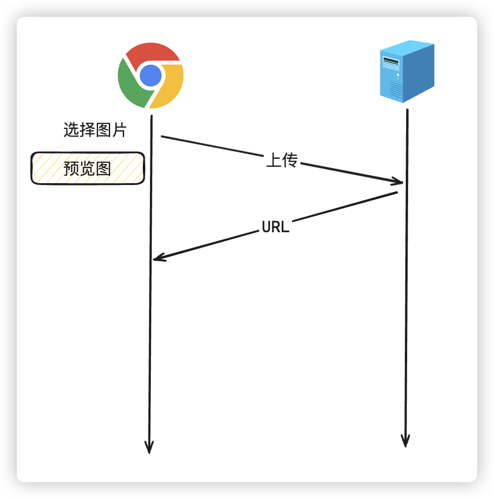

# 多文件预览支持

# 技术讲解

## 什么问题

相信大家都知道，如果我们上传或者下载了图片，都有在页面预览一下的需求，不过除了图片之外，其他的一些文件类型可能都有预览需求，比如视频，office相关文件，pdf，md，html等等文件都想实现预览效果该如何处理？

## 解决思路

不同类型的文件，文件运行时支持是不一样的

自有标签文件：图片、audio、video

纯文字的文件： markdown 、txt、代码

office类型的文件： docx、xlsx、ppt

embed引入文件：pdf、xmind

iframe：引入外部完整的网站

### 自有标签

浏览器本身就支持的图片、音视频标签这个好说，唯一要思考的是怎么更好的支持图片和视频预览。

我们要使用img标签src属性，拿到服务器的图片数据，传统的方式，要经历几个步骤才能拿到服务器的URL地址。


但是我们只是想预览图片，本身浏览器平台也支持img，能不能直接在本地就拿到数据进行预览呢？理想的步骤应该是下面这个样子



我们可以通过`FileReader API`与`dataurl`来解决预览图片问题，当然以前的方式也可以作为备案处理

```js
<input type="file" />

  

const inp = document.querySelector('input');
inp.onchange = (e) => {
  const file = e.target.files[0];
  const reader = new FileReader();
  reader.onload = (e) => {
    const dataurl = e.target.result;
    preview.src = dataurl;
  };
  reader.readAsDataURL(file);
};
```


音视频预览的话，如果希望看到真实效果，也可以采用图片类似的方式，只不过需要使用`URL.createObjectURL()`

```js
const inp = document.querySelector('input[type=file]');
inp.onchange = (e) => {
  const file = e.target.files[0];
  previewVideo(file)
};

function previewVideo(vdoFile){
  const vdo = document.createElement('video');
  // 静音, 由于浏览器限制，只有静音才能自动播放
  vdo.muted = true;
  // 让video自动播放
  vdo.autoplay = true;
  // createObjectURL可以把二进制的文件数据转换为浏览器可以播放的临时URL
  vdo.src = URL.createObjectURL(vdoFile);
  document.body.appendChild(vdo);
}

```

但是有时候我们可能需要的是可以预览视频帧图片即可，也就是说需要将视频帧截取出来，并画到界面上，这肯定就需要借助到`cavans`了

```js
function captureFrame(vdoFile,time = 0) {
  return new Promise((resolve) => {
    const vdo = document.createElement('video');
    // 设置参数指定时间
    vdo.currentTime = time;
    // 静音, 由于浏览器限制，只有静音才能自动播放
    vdo.muted = true;
    // 让video自动播放
    vdo.autoplay = true;
    // createObjectURL可以把二进制的文件数据转换为浏览器可以播放的临时URL
    vdo.src = URL.createObjectURL(vdoFile);
    // 监听视频是否准备好，可以播放，因为视频是异步加载的
    vdo.oncanplay = () => {
      // 创建canvas，用于绘制视频帧
      const cvs = document.createElement('canvas');
      cvs.width = vdo.videoWidth;
      cvs.height = vdo.videoHeight;
      const ctx = cvs.getContext('2d');
      ctx.drawImage(vdo, 0, 0, cvs.width, cvs.height);

      // 返回blob对象和url
      cvs.toBlob((blob) => {
        const url = URL.createObjectURL(blob);
        resolve({
          blob,
          url,
        });
      });
    };
  });
}

const inp = document.querySelector('input[type=file]');

inp.onchange = (e) => {
  const file = e.target.files[0];
  for (let i = 0; i < 10; i++) {
    captureFrame(file, i * 1).then((result) => {
      previewImage(result.url);
    });
  }
};

function previewImage(url) {
  const img = document.createElement('img');
  img.src = url;
  document.body.appendChild(img);
}
```

当然，也能使用原始的方式，先上传到服务器，服务器返回保存的URL地址，页面直接通过`<audio />`或者`<video />`标签打开服务器地址保存的URL地址就行了

### 纯文字文件

一般都是文本文件txt，或者代码，当然我这里把markdown文件也包含了进去。这几个处理思路都差不多，纯文本没什么可多说的，直接读取即可，代码和markdown文件最需要处理的就是样式和代码着色，这些都有专门的第三方库处理，比如就markdown文件而言，大家可以用用下面的一些第三方库

```text
marked : 用来解析markdown
marked-highlight : 用来代码块高亮
github-markdown-css : 设置markdown样式
highlight.js:语法高亮
```

类似于：

```js
<script lang="ts" setup>
import { ref } from "vue";
import md_content from "../assets/vite-12.md?raw";
import { onMounted } from "vue";
import { Marked } from "marked";
import { markedHighlight } from "marked-highlight";
import hljs from "highlight.js";
//高亮代码样式
import "highlight.js/styles/github-dark.css";

const contentDetails = ref();

const marked = new Marked(
  markedHighlight({
    langPrefix: "hljs language-",
    highlight(code, lang) {
      const language = hljs.getLanguage(lang) ? lang : "shell";
      return hljs.highlight(code, { language }).value;
    },
  })
);

onMounted(() => {
  contentDetails.value = marked.parse(md_content);
});
</script>

<template>
  <div>
    <div v-html="contentDetails"></div>
  </div>
</template>

```

### office类型文件

这类文件要去重复造轮子就没那个必要了，也没有那个时间成本，纯前端的手段其实很有限，有一些第三方库可以实现效果，不过也都不是太成熟，支持比较有限，有需要的同学可以了解一下，比如[vue-office](https://501351981.github.io/vue-office/examples/docs/)。用起来很简单

使用[kkfileview](https://kkfileview.keking.cn/zh-cn/index.html)，这就是一个在线预览解决方案，直接支持众多类型文件预览，而且开源协议也是`Apache2.0`，其实本身就可以一站式帮我们解决很多预览问题，不过需要私有化部署，需要单独的服务器处理，本身也不是纯前端的处理，还是需要把文件上传到自己的服务器。

这种做法其实微软本身就给我们提供了[免费的解决方案](https://learn.microsoft.com/en-us/archive/blogs/office_chs/office-web-viewer-office)：

```text
https://view.officeapps.live.com/op/view.aspx?src=<文档位置>
```

也就是说，我们只需要有一个公网的office文件地址，拼接上这个网址，就直接能解决这个问题。

不过最大的问题是，这个只能预览不能修改

如果希望修改的话，还可以使用[onlyoffice](https://www.onlyoffice.com/)，或者云服务，比如阿里云的[智能媒体管理 IMM](https://www.aliyun.com/product/imm)

### embed引入文件

pdf文件现在浏览器直接支持，也不用纠结太多，无论是embed还是iframe都是直接引入

```js
<embed src="http://xxx.xxx.com/record/xxx.pdf" />
<iframe
  src="http://xxx.xxx.com/record/xxx.pdf"
  width="100%"
  height="400"
/>
```

xmind文件的情况和office差不多，前端虽然有 [xmind-embed-viewer](https://github.com/xmindltd/xmind-embed-viewer)这个第三方库，但是还是需要有你**xmind文件的公网地址**，，加载的速度很慢，建议添加loading处理，而且在界面引用的话，xmind格式不对会引起一堆错误

```typescript
<template>
  <div id="xmind-container">
    <Loading v-if="showLoading" />
  </div>
</template>

<script setup lang="ts">
import { onMounted, ref } from 'vue'
import Loading from "./Loading.vue"

const showLoading = ref(true)

const props = defineProps({
  url: {
    type: String,
    required: true
  }
})

onMounted(async () => {
  const { XMindEmbedViewer } = await import('xmind-embed-viewer')
  const viewer = new XMindEmbedViewer({
    el: '#xmind-container', // HTMLElement | HTMLIFrameElement | string
    // 如果在中国大陆境内速度慢，可以添加的参数 `region: 'cn'` 改为使用 xmind.cn 的图库作为依赖。
    region: 'cn' //optional, global(default) or cn
  })
  viewer.setStyles({
    width: '100%',
    height: '100%'
  })
  const callback = () => {
    showLoading.value = false
    viewer.removeEventListener('map-ready', callback)
  }
  viewer.addEventListener('map-ready', callback)
  fetch(props.url)
    .then(res => res.arrayBuffer())
    .then(file => {
      viewer.load(file)
    })
    .catch(_err => {
      showLoading.value = false
      viewer.removeEventListener('map-ready', callback)
    })
})
</script>

<style>
#xmind-container {
  display: flex;
  height: 100%;
  align-items: center;
  justify-content: center;
}
</style>
```

引入：

```typescript
import XmindViewer from "./components/XmindViewer.vue";

// 还是需要公网的资源地址
<XmindViewer url="http://xxx.xxx.com/xxx/test-1.xmind" />
```


## 解决细节

### 1、[data url](https://developer.mozilla.org/zh-CN/docs/Web/HTTP/Basics_of_HTTP/Data_URLs)

Data URL 由四个部分组成：前缀（`data:`）、指示数据类型的 MIME 类型、如果非文本则为可选的 `base64` 标记、数据本身：

```
data:[<mediatype>][;base64],<data>
```

`mediatype` 是个 [MIME 类型](https://developer.mozilla.org/zh-CN/docs/Web/HTTP/Basics_of_HTTP/MIME_types)的字符串，例如 `'image/jpeg'` 表示 JPEG 图像文件。如果被省略，则默认值为 `text/plain;charset=US-ASCII`。

[JS中对Base64编码的处理](https://developer.mozilla.org/zh-CN/docs/Glossary/Base64)

```js
<input type="file" />

  
const inp = document.querySelector('input');
inp.onchange = (e) => {
  const file = e.target.files[0];
  const reader = new FileReader();
  reader.onload = (e) => {
    const dataurl = e.target.result;
    preview.src = dataurl;
  };
  reader.readAsDataURL(file);
};
```

### 2、[URL.createObjectURL() ](https://developer.mozilla.org/zh-CN/docs/Web/API/URL/createObjectURL_static)

### 3、公网地址的资源权限问题

office文件，pdf，xmind这些处理其实都需要引入你公网地址的资源路径，如果这些文件或者资源路径比较敏感的话，直接暴露出来并不是太好，有没有办法隐藏一下

可以添加一个BFF（Backend for Frontend）层来隐藏真实链接，BFF层可以作为前端与后端服务之间的中介，控制和验证用户的请求，然后从后端获取资源并返回给前端，而无需暴露真实的资源链接，简单来说，就是由BFF层做转发并且做统一的权限验证。

### 4、iframe引入外部完整的网站

> 有些网站设置了`X-Frame-Options`不允许其他网站嵌入，`X-Frame-Options` 是一个 `HTTP` 响应头，用于控制浏览器是否允许一个页面在 `<frame>`、 `<iframe>`、 `<embed>`、 或 `<object>` 中被嵌入。

`X-Frame-Options`有以下三种配置：

- **DENY**：完全禁止该页面被嵌入到任何框架中，无论嵌入页面的来源是什么。
- **SAMEORIGIN**：允许同源的页面嵌入该页面。
- **ALLOW-FROM uri**：允许指定的来源嵌入该页面。这个选项允许你指定一个 URI，只有来自该 URI 的页面可以嵌入当前页面。

**但是无论是哪种配置，我们作为非同源的网站，都无法将其嵌入到页面中**

比如：

```typescript
<!-- Refused to display 'https://www.ted.com/' in a frame because it set 'X-Frame-Options' to 'sameorigin'. -->
  <iframe
    src="https://www.ted.com/"
    title="iframe Example 1"
    width="400"
    height="300"
  >
  </iframe>
```

简单来说，`x-frame-options`就和同源策略一样，都是服务器返回了数据/页面，但是浏览器不予展示。
所以想消除`x-frame-options`在浏览器中的行为，最好的办法就是把这个响应头去掉。那么浏览器就会正常的展示对应的数据/页面。那么怎么去掉，就需要知道一些原理性问题：

#### 1、`x-frame-options`哪来的？

`x-frame-options`是目标服务器在返回response时，人为在其响应头中添加的。这个过程就是：

1. 客户端(比如浏览器)发起请求
2. 目标服务器响应该请求
3. 目标服务器返回真实数据 + 设置response响应头x-frame-options: sameorigin
4. 客户端发现x-frame-options为sameorigin，不展示真实数据

#### 2、如何去掉`x-frame-options`？

了解`x-frame-options`如何被添加后，解决思路就是，如何在**3、4中间**，将**response响应头x-frame-options直接干掉**，这样浏览器就察觉不到`x-frame-options`的存在，进而正常展示

通常采取的办法就是正向代理：在3、4中间，架设一个处理节点，这个处理节点可以改写目标服务器的响应头，将改写后的响应头再回传给客户端，即处理节点删除了响应头中的x-frame-options。

1. 如果你的web服务器是nginx，可以在nginx中，利用nginx的语法，删除response的响应头x-frame-options
2. 如果很难去操作线上的nginx配置，可以搭建一个BFF层，又或者直接让后端处理，在node服务器中删除响应的`x-frame-options`请求头

如果我们仅仅只是想测试，有个chrome插件[Ignore X-Frame headers](https://chromewebstore.google.com/detail/ignore-x-frame-headers/gleekbfjekiniecknbkamfmkohkpodhe)，可以帮我们测试这个问题
