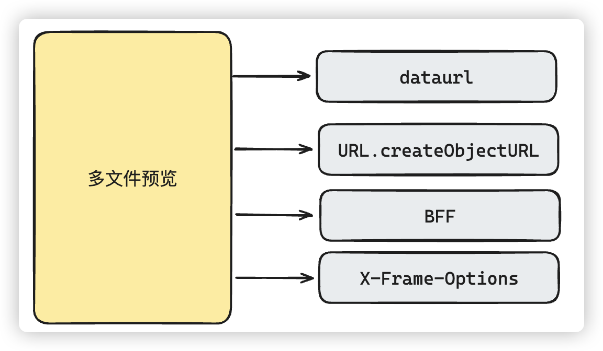

# 多文件预览

# 面试讲解

## 知识点图谱

## 难点描述

**模拟问题：**我看你的简历里面写了有一个亮点是对多文件预览的处理，并做了封装，这个你能详细说一下吗？

>**问题分析：**
>
>最好从项目需求各方面分析开始，表述出思考过各方面的解决办法，最终确立的解决方案。并且在描述的过程中能够吸引出面试官对于其他描述点的兴趣，引导面试官提问。当然最后还是要表述出解决的结果
>
>**参考回答：**
>
>(**难点问题场景**)对于多文件预览，其实一开始就考虑过云产品的智能媒体管理（IMM），不过出于当时项目体量和成本考虑就直接pass了，然后我们也选择部署了[kkfileview](https://kkview.cn/zh-cn/index.html)，这个就是一款文件文档在线预览解决方案，而且**开源协议也是Apache2.0**（**埋钩子：无论怎么样，涉及到一些后端开源的产品需要留意这个问题，有可能会引起面试官的兴趣**）。不过当时我们的项目更倾向于轻量级的处理，在前端可以选择更多的预览情况，所以就自己做了相应的处理。
>
>(**思考和解决办法**)对于预览的内容，我们做了大致的分类，比如有浏览器平台本身就支持的图片，视频这些，图片没什么可多说的，我们就使用了`FileReader`读取`dataurl`来实现本地预览。视频的话，做了两种处理要么直接通过`createObjectURL`直接预览视频，要么选择视频的关键帧通过`canvas`以图片的方式显示在页面上，当然可以通过页面选择关键帧截取时间和图片显示数量（**埋钩子：这里整个的实现过程可能会被面试官问起**）
>
>另外关于**整个office平台文件的预览，还有xmind预览**，其实纯前端的实现是很难的，我们也没有那个精力和成本重新造一遍轮子，所以首先找了一些实现比较好的第三方库来处理这个问题。不过这些第三方库都的实现都不是太完美，pdf和xmind的预览还是需要公网地址，
>
>所以我们还是选择了备选方案，用户如果不是想要实时预览的话，office文件的预览也线上预览的方式，这种方式非常的简单，就拼接一下office提供的地址和我们自己资源的地址就可以实现预览，缺点就是很慢，而且最关键的暴露了资源的公网地址，我们通过**BFF层来做了一层中转，隐藏真实链接**（**埋钩子，引起面试官询问**）
>
>纯文本文件像txt，代码和markdown这些就直接使用常见的第三方库，比如Marked，highlight实现预览
>
>html要引入也就是iframe了，不过有一些网站如果设置了`X-Frame-Options`头信息，是不能嵌入的，我们使用的办法还是直接用BFF层，删除响应的`x-frame-options`信息（**埋钩子：引起面试官询问**）
>
>最后把这些解决方案做了统一的基于不同前端框架的**业务组件封装**，公司常用文件的预览都没有太大问题，而且还顺便处理了预览文件的权限问题。公司其他的项目组也能很方便的使用
>
>(询问面试官，有哪些细节需要详细说明)

## 知识点叙述

### 1、URL.createObjectURL

**模拟问题：**你刚刚说预览视频可以直接获取视频的关键帧，并且以图片的方式显示到页面，这种做法能详细说一下吗？

> **问题分析：**
>
> 主要考察的是思考过程，整个过程的描述应该是条例清晰，步骤明确的，这样给面试官的感觉就会非常的好。
>
> **参考回答：**
>
> 要实现这个效果，首先需要明确我们最终希望生成的是图片，其实**最好的办法就是使用canvas**，因为canvas能帮我们生成Image，还可以生成上传需要的blob和url地址。
>
> 但是我们上传的是一个文件，**文件是不能直接在canvas中使用**的，所以我们可以使用上传的文件生成`video`标签，因为**video，img标签这些，是可以直接画到canvas里面**的。
>
> 所以，整体的思路就是，根据你选择的文件，把他放在video里面去，根据你传递的时间，然后定格在某一帧。然后再直接把video放入到canvas中画出来。最后我们就可以通过canvas导出需要的blob和url。
>
> 当然在使用video标签，定格某一帧的时候要注意，默认视频在video上是不能直接播放的，这是浏览器策略所决定的，所以我们必须让视频静音。

### 2、BFF中间层

**模拟问题：**为什么你要在加入BFF中间层呢？

> **问题分析：**
>
> 涉及到具体的业务需求，我们将具体的业务需求说清楚就行了
>
> **参考回答：**
>
> 因为office文件，pdf和xmind文件的预览处理的比较简单，就是当文件上传之后，放在公网的地址上，然后界面上相当于直接访问的公网资源地址。
>
> 但是有一些文件又有可能涉及到权限问题，并不希望公开，所以就通过BFF，中间套了一层，简单来说，就通过BFF做了转发和统一的权限验证。同时也对外隐藏了真实链接

### 3、`X-Frame-Options`

**模拟问题：** `X-Frame-Options`头信息iframe不能引入是什么意思？为什么要通过BFF来解决呢？

> **问题分析：**
>
> 基础问题，这种问题最好回答的有理有据，能够追根溯源。
>
> **参考回答：**
>
> 如果我们的请求，返回的响应带有`X-Frame-Options`头信息，`X-Frame-Options`有几种值
>
> DENY拒绝所有请求，**SAMEORIGIN**只允许同源嵌入请求，ALLOW-FROM uri运行指定的地址嵌入请求
>
> 一般我们作为作为非同源的网站，无法通过iframe将其嵌入到页面中，简单来说，`x-frame-options`就和同源策略一样，都是服务器返回了数据/页面，但是浏览器不予展示。所以想消除`x-frame-options`在浏览器中的行为，最好的办法就是把这个响应头去掉。
>
> 前端如果直接获取相应，是没有办法去掉响应头的，所以我们要做的，就是在前端获取数据之前，通过BFF中间层，去掉`X-Frame-Options`头信息，然后再转发给前端。当然这个也可以通过nginx服务器处理，利用nginx的语法，删除response的响应头x-frame-options
