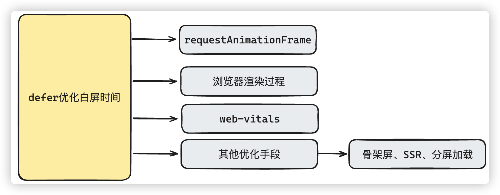

# defer优化白屏时间

# 面试讲解

## 知识点图谱

## 难点描述

**模拟问题：**我看你的简历里面写了有一个亮点是通过defer方案，完成首屏的切片化渲染，这个你能详细说一下吗？

> **问题分析：**
>
> 回答的基本原则还是遵循以下的原则：
>
> 1、遇到的问题或困难（S: Situation）
>
> 2、列举问题难点或者思考过程（T: Task）
>
> 3、根据确定的解决方案实施的行动（A: Action）
>
> 4、解决问题的结果，对项目、对团队、对公司的帮助，对个人的提升（R: Result）
>
> 当然回答过程中，对相应涉及到的知识点，要引导面试官，给面试官埋下钩子
>
> **参考答案：**
>
> 因为我们的这个项目，用户首页打开的速度特别的慢，无论是我们自己测试也好，还是根据监控埋点反馈的数据也好，基本可以排除其他网络因素，主要原因还是因为首屏渲染的DOM内容特别的多。这个当然我们自己也清楚，所以**一开始就给用户做了骨架屏和延迟分屏渲染的相关优化**。
>
> 但是这两个并不能解决关键问题，骨架屏本身就是治标不治本的做法，而分屏渲染只是解决了不在当前视口的DOM内容优化渲染的问题。而我们项目的麻烦点在于，首屏内容本身的DOM阶段渲染就十分的多（可能**面试官会处于好奇**，什么项目首屏这么麻烦，一般涉及数据密集型仪表板显示的，DOM会十分的密集），分屏分页只能解决不在当前视口内容渲染的问题。
>
> 当然也考虑过SSR，但是SSR虽然是解决渲染问题的大招，但是本身该有的大量DOM节点内容在客户端还是要进行渲染。而且最重要的，**项目的成本预算并不打算把压力放在服务器上来，这个想法也没有可行性（埋钩子：引起面试官兴趣）**
>
> 最后想到了`requestAnimationFrame`进行分帧渲染的方式，和我们现在的需求是最契合的。根本原理就是借助`RAF`下一次重绘（repaint）之前执行回调函数，将长任务分帧分解成一个个的短任务，当然还需要封装相关的脚本工具，探测页面的节点，根据节点渲染的优先级进行处理（**埋钩子：引起面试官询问兴趣**）
>
> 这样的处理，对原有的代码侵入性最少，而且以比较简单直接的方式，解决了首屏渲染时间过长的问题，经过这样优化之后，首屏的FCP，LCP时间大幅度降低，用户留存率(RR)也有明显的改善。
>
> （最后追问面试官，哪些地方需要详细说明一下）

## 知识点叙述

### 1、requestAnimationFrame

**模拟问题：**能详细说一下具体怎么通过`RAF`进行分帧渲染的吗？

> **参考答案：**
>
> 首先，其实`RAF`的根本是在**下一次重绘（repaint）之前会执行回调函数**，所以问题的关键点是，我们可以利用**vue响应式数据的更新机制**，在**每一帧更新一个响应式数据的值**，比如一个不重复的自增的值。而在 Vue 中，任何依赖于 这个**响应式数据的组件或计算属性都会在数据改变时自动更新**，由于**数据的更新是逐帧进行的，这样就实现了分帧渲染的效果**
>
> 对于界面上使用的话，我们可以使用脚本或者插件的方式，遍历页面节点，根据页面css相关命名规范确定页面渲染的优先级，动态的给相应的节点加入defer函数，确保对应的节点可以依次进行渲染

### 2、SSR

**模拟问题：**为什么你不使用SSR来优化渲染呢？

> **问题分析：**
>
> 这是上面回答引出的钩子，基本上，提到渲染问题，终极的解决方案肯定是SSR，但是这个需要根据实际情况来确定，实际情况中并不是像技术一样，随便说说就完了，还需要具体问题具体分析
>
> **参考答案：**
>
> SSR的方案当然可以帮我们解决一部分渲染的问题，但是其实我们主要的问题是首屏的节点就很多，无论怎么样，就算服务器端渲染了，传递到客户端还是需要渲染的。
>
> 当然这肯定大大减轻了客户端浏览器渲染的压力，不过最重要的问题也在这里，SSR相当于把运算压力给到了服务器端，也就是说，前端服务器需要承受动态渲染的压力。
>
> 实际情况就是本身前端服务器基本配置跑起来没问题。但是上了SSR之后，这服务器我们需要额外的申请。
>
> 如果效果没有达标，这设备的问题很容易产生纠纷，**这种问题很容易背锅啊...**

### 3、性能指标

**模拟问题：**你多次提到了性能指标相关的内容，你能具体聊一聊吗？

> **问题分析：**
>
> 性能指标的内容比较的多，不用铺开了和面试官聊，总结一些关键的指标点即可，像这种问题，不要和面试官做过多的纠缠，因为本身设计的点很多，可修改，可改进的方式也有很多，而且每种改进方式随着你的项目不一样，处理的方式也不一样。
>
> 如果你遇到了在这个问题上死缠烂打的面试官，你可以准备一个方向，具体的说明即可。
>
> 所有网站性能相关的内容，其实你都可以在[Web.dev](https://web.dev/explore/metrics?hl=zh-cn)网站上找到答案，建议大家没事多读一读。毕竟性能优化是我们简历中，面试中经常出现的词语。
